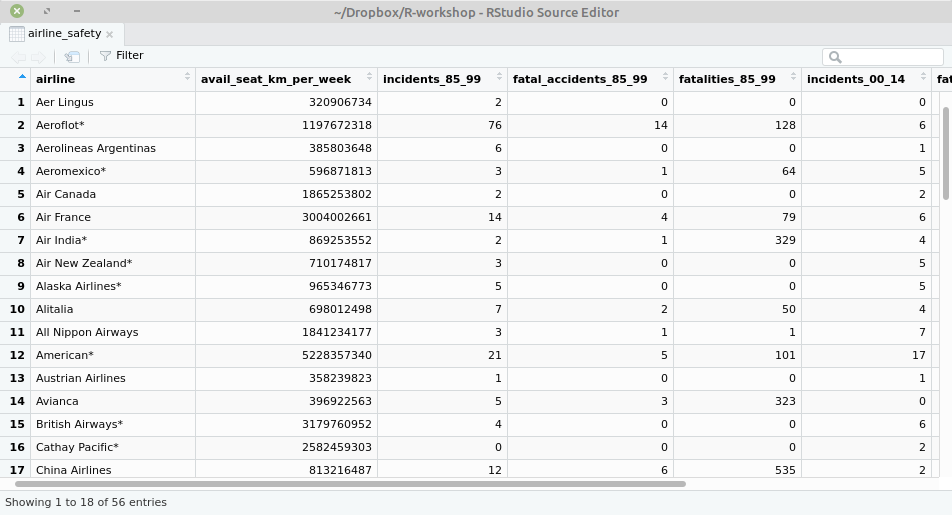

```{r setup, include=FALSE}
options(htmltools.dir.version = FALSE)
knitr::opts_chunk$set(comment = "R>", message = FALSE, warning = FALSE)
library(readr)
library(readxl)
```


# Overview

<br>

- .huge[Data formats]

<br>

- .huge[`readr` and its friends]

---

# Common data formats

--

## Rectangualar data


- .large[CSV and friends]


- .large[Excel (xls, xlsx)]


- .large[Proprietary softwares (SPSS, Stata, SAS)]


- .large[Databases]

--

## Hierarchical data


- .large[JSON, XML]


---

# Common data formats

## Rectangualar data


- .large[.greenfont[.bold[CSV and friends]]]


- .large[.greenfont[.bold[Excel (xls, xlsx)]]]


- .large[Proprietary softwares (SPSS, Stata, SAS)]


- .large[Databases]

## Hierarchical data


- .large[JSON, XML]


---

# CSV and friends

```{r, eval=FALSE}
# install.pacakges("readr")
library(readr)
```

.center[]

---

# comma-separated files (`,`)

```r
"mpg","cyl","disp","hp","drat","wt","qsec","vs","am","gear","carb"
21,6,160,110,3.9,2.62,16.46,0,1,4,4
21,6,160,110,3.9,2.875,17.02,0,1,4,4
22.8,4,108,93,3.85,2.32,18.61,1,1,4,1
21.4,6,258,110,3.08,3.215,19.44,1,0,3,1
18.7,8,360,175,3.15,3.44,17.02,0,0,3,2
18.1,6,225,105,2.76,3.46,20.22,1,0,3,1
14.3,8,360,245,3.21,3.57,15.84,0,0,3,4
24.4,4,146.7,62,3.69,3.19,20,1,0,4,2
22.8,4,140.8,95,3.92,3.15,22.9,1,0,4,2
```


---

# semicolon-separated files (`;`)

```r
"mpg";"cyl";"disp";"hp";"drat";"wt";"qsec";"vs";"am";"gear";"carb"
21;6;160;110;3.9;2.62;16.46;0;1;4;4
21;6;160;110;3.9;2.875;17.02;0;1;4;4
22.8;4;108;93;3.85;2.32;18.61;1;1;4;1
21.4;6;258;110;3.08;3.215;19.44;1;0;3;1
18.7;8;360;175;3.15;3.44;17.02;0;0;3;2
18.1;6;225;105;2.76;3.46;20.22;1;0;3;1
14.3;8;360;245;3.21;3.57;15.84;0;0;3;4
24.4;4;146.7;62;3.69;3.19;20;1;0;4;2
22.8;4;140.8;95;3.92;3.15;22.9;1;0;4;2
```

---

# tab-separated files (`\t`)

```r
"mpg"	"cyl"	"disp"	"hp"	"drat"	"wt"	"qsec"	"vs"	"am"	"gear"	"carb"
21	6	160	110	3.9	2.62	16.46	0	1	4	4
21	6	160	110	3.9	2.875	17.02	0	1	4	4
22.8	4	108	93	3.85	2.32	18.61	1	1	4	1
21.4	6	258	110	3.08	3.215	19.44	1	0	3	1
18.7	8	360	175	3.15	3.44	17.02	0	0	3	2
18.1	6	225	105	2.76	3.46	20.22	1	0	3	1
14.3	8	360	245	3.21	3.57	15.84	0	0	3	4
24.4	4	146.7	62	3.69	3.19	20	1	0	4	2
22.8	4	140.8	95	3.92	3.15	22.9	1	0	4	2
```
---

# Syntax


| Files                     | Special cases        | General solution                  |
|---------------------------|----------------------|-----------------------------------|
| comma-separated     | read_csv(file, ...)  | read_delim(file, sep = ",", ...)  |
| semicolon-separated | read_csv2(file, ...) | read_delim(file, sep = ";", ...)  |
| tab-separated       | read_tsv(file, ...)  | read_delim(file, sep = "\t", ...) |

### Linux/Mac

.large[`file = "/path/to/your/file.csv"`]

### Windows

.large[`file = "\\\\path\\\\to\\\\your\\\\file.csv"`]


---
class: center, middle

.h9[Data sets]

.h9[http://bit.ly/2lqjv5r]

---

# Working directories

.large[Common new user mistakes:]


.large[trying to read files that R “can’t find”]


---

# Working directories

.large[R “looks” for files on your computer relative to the “working” directory]

----------

```{r}
getwd() # get working directory

dir()  # show directory contents
```


---

```{r, message=TRUE}
# relative path
airline_safety <- read_csv("airline-safety.csv") 
```

```{r, message=TRUE}
# absolute path
airline_safety <- read_csv("/home/anchu/Dropbox/R-workshop/slides/data_import/airline-safety.csv")
```


---

# Your turn

.large[Try to read the following files:]


- .large[`mtcars1.csv`]

- .large[`mtcars2.csv`]

- .large[`mtcars3.csv`]


---

# Parsing

.large[`readr` automatically guesses the type of each column]

- .large[col_integer(): natural numbers (1, 2, 3, 4, 5)]


- .large[col_double(): real numbers (3.14)]


- .large[col_character(): strings ("male", "female")]


- .large[col_date(): date formats ('2017-12-31')]


- .large[col_datetime(): date-time formats ('2017-12-31 12:15:00')]


---

# Column names


- .large[By default, `readr` uses the first row as column names]

---

# Column names

- .large[Use `col_names = FALSE` when the data does not have column names]

```r
### no_headings.csv
21,6,160,110
21,6,160,110
22.8,4,108,93
21.4,6,258,110
```

```{r}
read_csv("no_headings.csv", col_names = FALSE)
```

---

# Column names

- .large[Pass `col_names` a vector of strings to override the default]

```r
### no_headings.csv
21,6,160,110
21,6,160,110
22.8,4,108,93
21.4,6,258,110
```

```{r}
read_csv("no_headings.csv", 
         col_names = c("col1", "col2", "col3", "col4"))
```

---

# Equivalent to base R


.pull-left[

### base R

- .large[`read.csv()`]


- .large[`read.csv2()`]


- .large[`read.table()`]

]

.pull-right[

### readr

- .large[`read_csv()`]

- .large[`read_csv2()`]

- .large[`read_delim()`]

]

---

# Compared to base R


## readr:

- .large[faster (~10x)]

- .large[better default (don't convert character to factors, use row names, or change column names)]

---

# Quick data exploration

```{r, eval=FALSE}
{{str(airline_safety)}}
```

```r
R> Classes 'tbl_df', 'tbl' and 'data.frame':    56 obs. of  8 variables:
R>  $ airline               : chr  "Aer Lingus" "Aeroflot*" "Aerolineas Argentinas" "Aeromexico*" ...
R>  $ avail_seat_km_per_week: num  3.21e+08 1.20e+09 3.86e+08 5.97e+08 1.87e+09 ...
R>  $ incidents_85_99       : int  2 76 6 3 2 14 2 3 5 7 ...
R>  $ fatal_accidents_85_99 : int  0 14 0 1 0 4 1 0 0 2 ...
R>  $ fatalities_85_99      : int  0 128 0 64 0 79 329 0 0 50 ...
R>  $ incidents_00_14       : int  0 6 1 5 2 6 4 5 5 4 ...
R>  $ fatal_accidents_00_14 : int  0 1 0 0 0 2 1 1 1 0 ...
R>  $ fatalities_00_14      : int  0 88 0 0 0 337 158 7 88 0 ...
[truncated]
```

---

```{r}
{{head(airline_safety)}}

{{tail(airline_safety)}}
```

---

```{r}
{{summary(airline_safety)}}
```

---

```{r, eval=FALSE}
{{View(airline_safety)}}
```




---

# Excel 

```{r, eval=FALSE}
# install.packages("readxl")
library(readxl)
```

.center[]

---

# Syntax

.large[`read_xls(file, ...)`]

<br>

.large[`read_xlsx(file, ...)`]


---

```{r}
tomato100 <- read_xlsx("Rotten_Tomatoes_100_Movies.xlsx")
tomato100
```


