```{r setup, include=FALSE}
options(htmltools.dir.version = FALSE)
knitr::opts_chunk$set(comment = "R>", message = FALSE, warning = FALSE)
library(dplyr)
```


background-image: url(hex-dplyr.png)
background-size: contain

---
class: center, middle

.giant[.bold[dplyr]]

.big[a grammar of data manipulation]

---
background-image: url(wordcloud.png)
background-size: contain

---
class: center, middle

.supergiant[80/20]

---
background-image: url(janitor_work.png)
background-size: contain


---

# Context

--

.huge[When doing data analysis you must:]

<br>

- .huge[Find out what you intend to do]

--

<br>

- .huge[Precisely describe what you want in the form of codes]

---

# Why dplyr?

.huge[dplyr package make these steps as easy as possible by:]

--

- .huge[Providing the most common data manipulation operations, so that you are
helpfully guided when working on a problem]

--

- .huge[Providing intuitive syntax, so that you can easily translate your
thoughts into codes]

---
class: center, middle

.h9[Data sets]

.h9[http://bit.ly/2lqjv5r]


---
background-image: url(hn_airquality.png)
background-size: cover

---

# Hanoi Air Quality Data

<br>

.huge[.bold[`air_quality`:]] .huge[[17,583 x 13]. Hourly measurement of PM2.5 articles from
Dec 2015 to Dec 2017]

<br>

.huge[Source: U.S. Embassy in Hanoi (https://vn.usembassy.gov/embassy-consulate/embassy/air-quality-monitor/)]


---

# Hanoi Weather History Data

<br>

.huge[.bold[`weather`:]] .huge[[6,556 x 9]. Daily weather data 2000-2017]

<br>

.huge[Source: freemeteo.vn]


---
class: inverse, center, middle

.h0[One-table verbs]


---

.huge[.bold[filter:]] .huge[picks observations based on their values]

<br>

.huge[.bold[select:]] .huge[picks variables based on their names]

<br>

.huge[.bold[arrange:]] .huge[changes the ordering of the rows]

<br>

.huge[.bold[mutate:]] .huge[add new variables]

<br>

.huge[.bold[summarise:]] .huge[reduce multiple values to a single summary]


---

# Grammar

.center[
.superhuge[verb(data, ...)]
]

<br>

.huge[`...`: what you intend to do with the data]


---
class: inverse, center, middle

.h0[filter]

---

# A toy example

```{r, eval=FALSE}
dtf <- data.frame(
    gender = c("Male", "Female", "Female", "Male", "Female"),
    age = c(38, 26, 29, 24, 30),
    stringsAsFactors = FALSE
)
```

.center[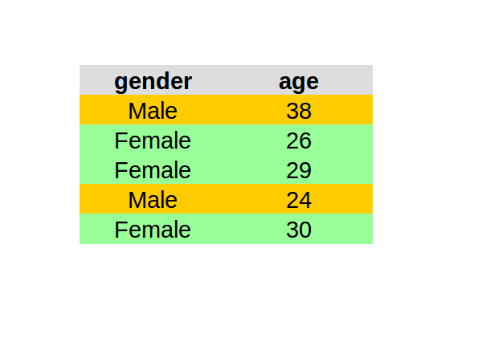]

---
class: center, middle

.huge[.scp[filter(dtf, gender == "Female")]]

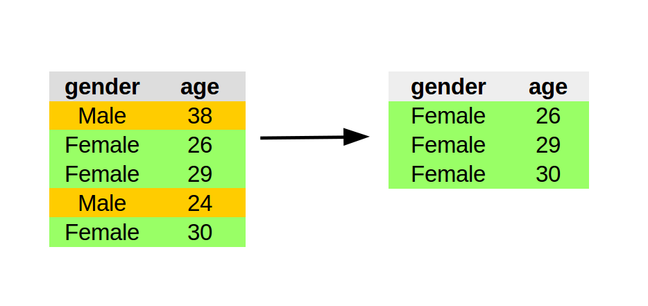


---
class: center, middle

.huge[.scp[filter(dtf, age >= 28)]]

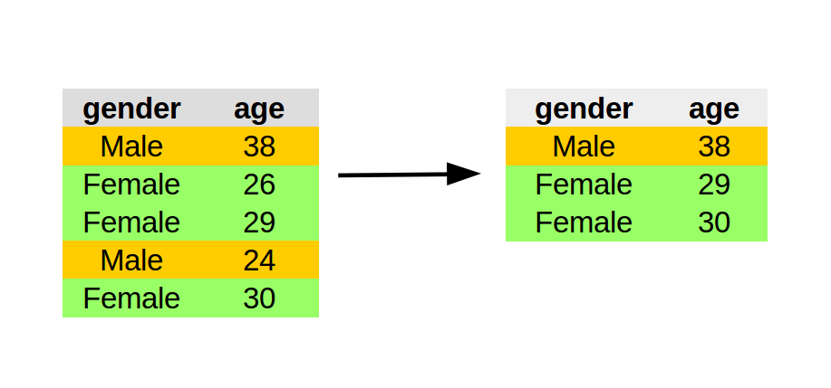


---
class: center, middle

.huge[.scp[filter(dtf, gender == "Female" | age < 25)]]

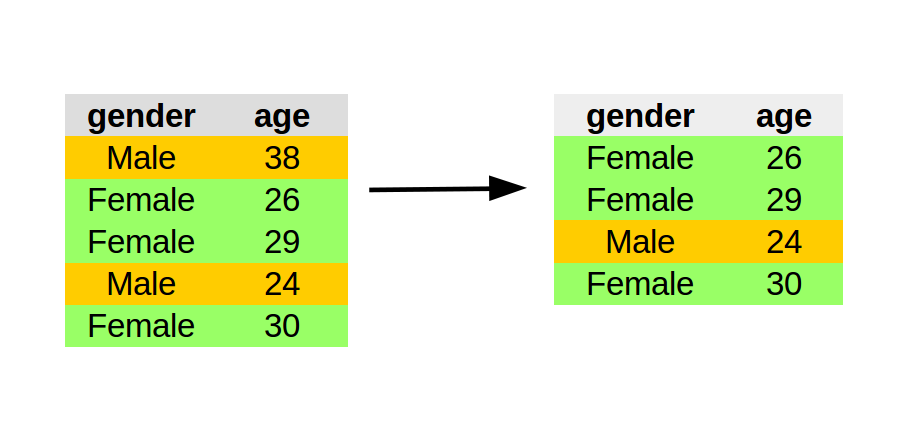


---

# Logic in R

.huge[x .greenfont[==] 1: equal to; x .greenfont[!= 1]: not equal to]

.huge[x .greenfont[<] 1: less than]

.huge[x .greenfont[<=] 1: less than or equal to]

.huge[x .greenfont[>] 1: greater than]

.huge[x .greenfont[\>=] 1: greater than or equal to]

.huge[x .greenfont[%in%] c(1, 2): group membership]

.huge[.greenfont[is.na](x): is missing values]

.huge[.greenfont[!is.na](x): is not missing values]


---

# Logic in R

<br>

<br>

.huge[Always return logical values (TRUE/FALSE)]

---

# Logic in R

```{r}
x <- c(2, 1, 7, 4, 9)

x >= 3

x %in% c(2, 4, 6)

x == c(2, 4, 6) # dont do this

y <- c(12, 14, 8, NA, 6)
is.na(y)
```


---

# Logic in R

.pull-left[
.center[.huge['|': or]]
```{r}
TRUE | TRUE
TRUE | FALSE
```
]

.pull-right[
.center[.huge['&': and]]
```{r}
FALSE & TRUE
FALSE & FALSE
```
]


---

# Your turn

.huge[Find records:]

- .huge[In November 2017]

- .huge[In January, Febuary, March]

- .huge[Between 6am and 7pm]

- .huge[That have AQI level of health concern: `'Very Unhealthy'` ]

- .huge[That have AQI greater than the average]


---

# Solution


```r
filter(air_quality, year == 2017, month == 1)

filter(air_quality, hour >= 6 & hour <= 19)

filter(air_quality, aqi >= 201 & aqi <= 300)

filter(air_quality, aqi > mean(aqi)) # something wrong

filter(air_quality, aqi > mean(aqi, na.rm = TRUE))
```


---
class: inverse, center, middle

.h0[select]

---
class: center, middle

.huge[.scp[select(dtf, gender)]]

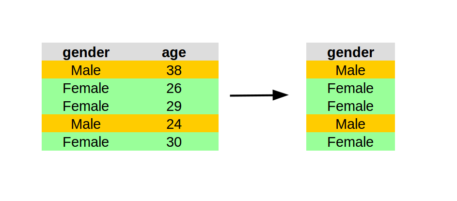

---
class: center, middle

.huge[.scp[select(dtf, -gender)]]


---

# Your turn

.huge[Read `help(dplyr)`. Find out other ways to select columns in a data frame.]

.huge[Wrie code to:]

- .huge[Select time-related variables]

- .huge[Select the two AQI variables]

---

# Solution

```r
select(air_quality, datetime:hour)

select(air_quality, contains("aqi"))

select(air_quality, starts_with("aqi"))

select(air_quality, aqi, aqi_categ)
```

---
class: inverse, center, middle

.h0[arrange]

---
class: center, middle

.huge[.scp[arrange(dtf, age)]]

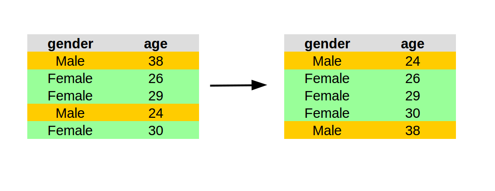


---
class: center, middle

.huge[.scp[arrange(dtf, desc(age))]]

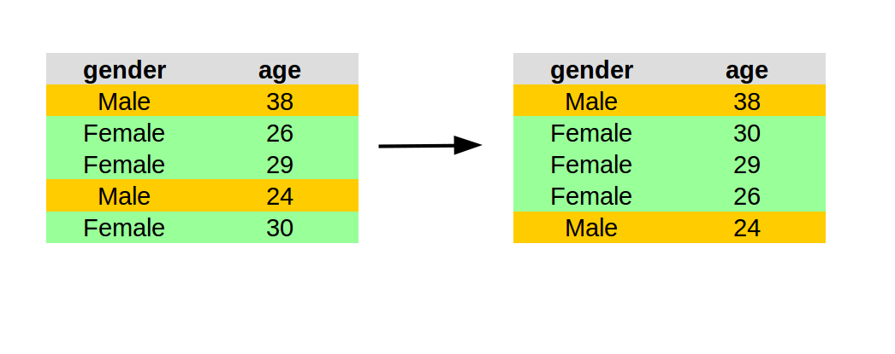

---

# Your turn

- .huge[Re-arrange the air quality data by descending order of time]

- .huge[Which days had the highest AQI?]

---

# Solution

```r
arrange(air_quality, date, hour)

arrange(air_quality, year, month, day, hour)

arrange(air_quality, desc(aqi))
```


---
class: inverse, center, middle

.h0[mutate]

---
class: center, middle

.huge[.scp[mutate(dtf, yob = 2017 - age)]]


---
class: center, middle

.large[.scp[mutate(dtf, sex = ifelse(gender == "Female", yes = "F", no = "M"))]]

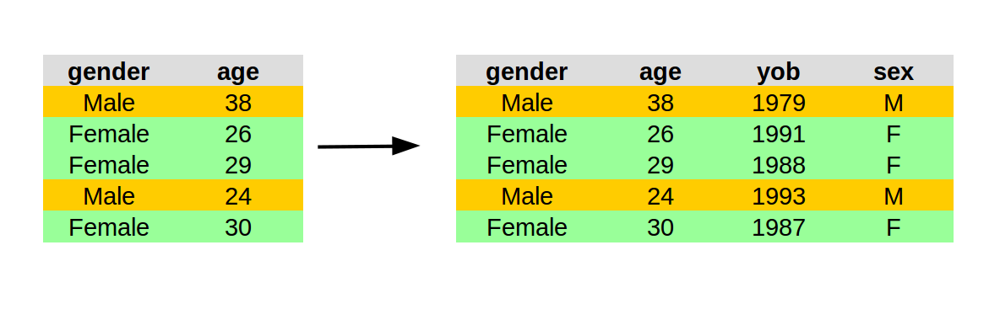

---

# Your turn

- .large[Add a new variable (`is_good`) to indicate (TRUE/FALSE) whether an observation
had AQI in the `Good` level]

- .large[Add a new variable (`aqi_color_code`) to decode AQI level in color scheme 
from Good to Haxardous: `green`, `yellow`, `orange`, `purple`, and `brown`]

---

# Solution

```r
mutate(air_quality, is_good = aqi <= 50)

mutate(air_quality,
       aqi_color_code = ifelse(aqi <= 50, "green",
                        ifelse(aqi >= 51 & aqi <= 100, "yellow",
                        ifelse(aqi >= 101 & aqi <= 150, "orange",
                        ifelse(aqi >= 151 & aqi <= 200, "red",
                        ifelse(aqi >= 201 & aqi <= 300, "purple",
                        ifelse(aqi >= 301, "brown", NA))))))
           )
```

---
class: inverse, center, middle

.h0[summarise]


---
class: center, middle

.huge[.scp[summarise(dtf, avg_age = mean(age))]]

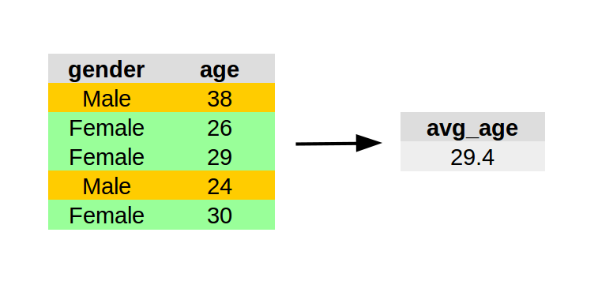


---

# split - apply - combine

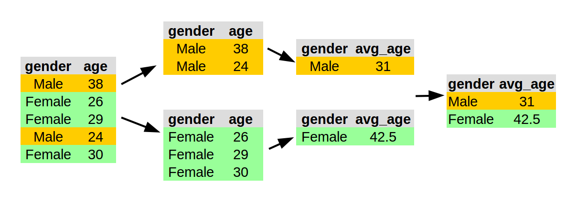

---
class: center, middle

.huge[.scp[by_gender <- group_by(dtf, gender)]]
.huge[.scp[summarise(by_gender, avg_age = mean(age))]]

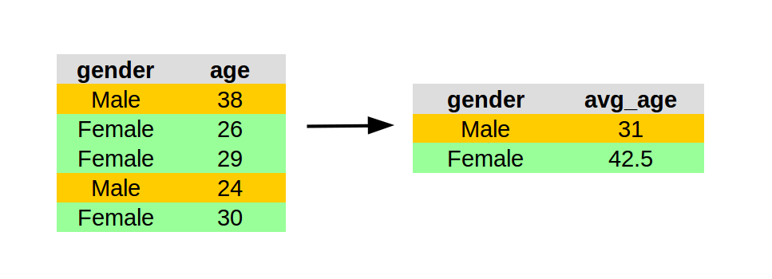

---

# Summary functions


- .huge[min(x), median(x), max(x)]

<br>

- .huge[sd(x), var(x)]

<br>

- .huge[n(), n_distinct()]

<br>

- .huge[sum(x < 10), mean(x > 10)]

---

# Your turn

.huge[Compute:]

- .huge[Number of observations by year and month]

- .huge[Averge and deviation of AQI by year and month]

- .huge[Highest and lowest AQI by hour]


---

# Solution

```r
by_year_month <- group_by(air_quality, year, month)

summarise(by_year_month, n())
summarise(by_year_month,
          avg_aqi = mean(aqi, na.rm = TRUE),
          sd_aqi = sd(aqi, na.rm = TRUE))

by_hour <- group_by(air_quality, hour)

summarise(by_hour,
          max_aqi = max(aqi, na.rm = TRUE),
          min_aqi = min(aqi, na.rm = TRUE))
```


---
class: inverse, center, middle

.h0[Two-table verbs]


---

# Motivation

<br>

<br>

.huge[Complex problems often require more than one dataset]


---
background-image: url(join-venn.png)
background-size: contain


---

# A toy example

```{r}
x <- data.frame(key = c(1, 2, 3),
                val_x = c("x1", "x2", "x3"))
y <- data.frame(key = c(1, 2, 4),
                val_x = c("y1", "y2", "y3"))
```

.pull-left[

]

.pull-right[

]

---

# Inner join


```{r}
inner_join(x, y, by = "key")
```

---

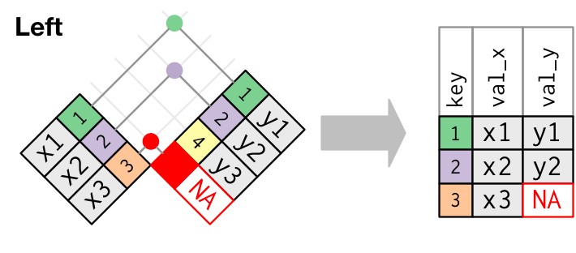

```{r}
left_join(x, y, by = "key")
```

---

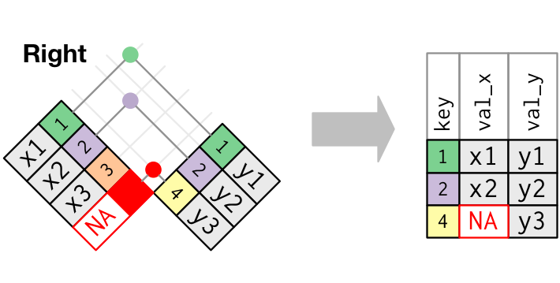

```{r}
right_join(x, y, by = "key")
```

---
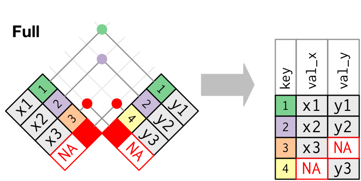

```{r}
full_join(x, y, by = "key")
```

---

# Your turn

.large[With your neighbor, figure out how to:

- .large[calculate the max, min and average AQI perday] and

- join with the Hanoi Weather History data]

---

# Solution

```{r, eval=FALSE}

air_quality <- read_csv("air-quality.csv")
weather <- read_csv("hanoi_weather_history.csv")

by_date <- group_by(air_quality, date)

airquality_by_date <- summarise(
    by_date,
    min_aqi = min(aqi, na.rm = TRUE),
    max_aqi = max(aqi, na.rm = TRUE),
    avg_aqi = mean(aqi, na.rm = TRUE))

airquality_by_date <- left_join(airquality_by_date, weather, 
                                by = "date")
```

---
class: inverse, center, middle

.h0[pipelines]

---

<br>

<br>

.supergiant[.bold[%>%]]


---
background-image: url(pipeline.png)
background-size: 70%

???

https://www.linkedin.com/pulse/data-pipeline-hadoop-part-1-2-birender-saini/

---

# Context

--

```{r, eval=FALSE}
x <- c(0.109, 0.359, 0.63, 0.996, 0.515, 0.142, 0.017, 0.829, 0.907)
min(round(exp(diff(log(x))), 1)) # hard to read
```

--

```{r, eval = FALSE}
# cumbersome
x1 <- log(x)
x2 <- diff(x1)
x3 <- exp(x2)
x4 <- round(x3, 1)
x5 <- min(x4)
```

--

```{r, eval=FALSE}
library(dplyr)
# straight forward
x %>% log() %>% diff() %>% exp() %>% round(1) %>% min()
```

---

# Why pipelines

--

- .large[Avoid nested function calls]

--

<br>

- .large[Minimize the need for temporary variables]

--

<br>

- .large[Make it easy to add steps anywhere in the sequence of operations]

--

<br>

.large[==> Easier to read, to understand, so to debug]

---

# Your turn

.large[With your neighbor, figure out how to:

- .large[calculate the max, min and average AQI perday] and

- join with the Hanoi Weather History data]

.large[.greenfont[This time, use pipe operator]]

---

# Solution

```{r, eval=FALSE}
air_quality <- read_csv("air-quality.csv")
weather <- read_csv("hanoi_weather_history.csv")

air_quality %>%
    group_by(date) %>%
    summarise(
        min_aqi = min(aqi, na.rm = TRUE),
        max_aqi = max(aqi, na.rm = TRUE),
        avg_aqi = mean(aqi, na.rm = TRUE)
    ) %>%
    left_join(weather, by = "date") -> airquality_by_date

airquality_by_date
```


---

# Let's play a game

--

.large[Two teams of A and B.]

.large[With your team, try to come up with two questions from the previous data sets 
that can be answered by using `dplyr`.]

.large[Each team has 5 min to prepare questions and 5 mins for the answers.]

.large[The winner is the team that has the correct answers first.]


---

# That covers 80% of dplyr


.pull-left[
- .large[filter]

- .large[select]

- .large[arrange]

- .large[mutate]

- .large[group_by, summarise]
]

.pull-right[

- .large[left_join]

- .large[right_join]

- .large[full_join]

- .large[inner_join]

]

---

# Other 20%

- .large[assembly: `bind_rows`, `bind_cols`]

<br>

- .large[filtering join: `anti_join`, `semi_join`]

<br>

- .large[column-wise operation: `summarise_each`, `mutate_if`, ...]

<br>

- .large[windown functions: `min_rank`, `percent_rank`]

<br>

- .large[database backend]

---

# Wrap-up

--

- .huge[Intuitive syntax]

--

<br>

- .huge[Easy-to-read code]

--

<br>

- .huge[Focus on thinking with data, not implementaion]

---
class: inverse, center, middle

.h0[Q&A]
