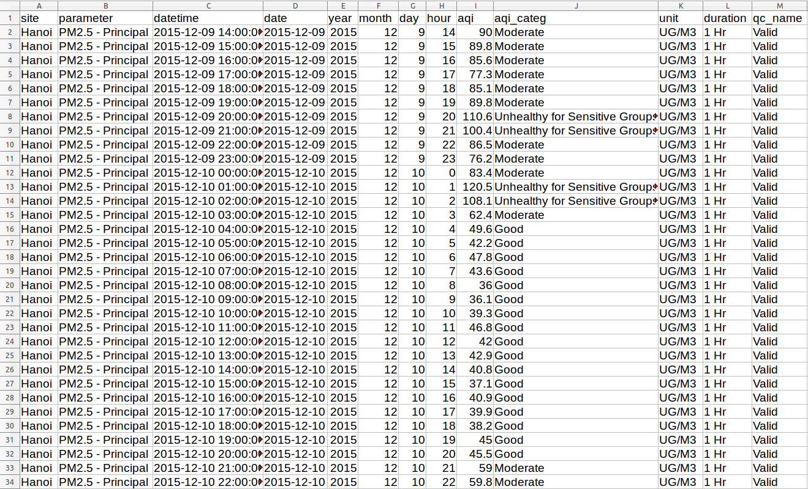
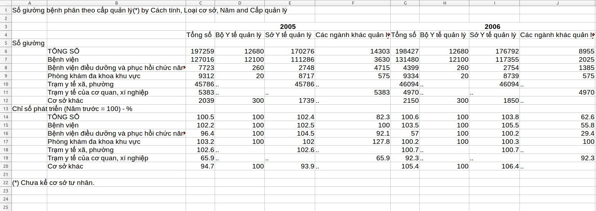
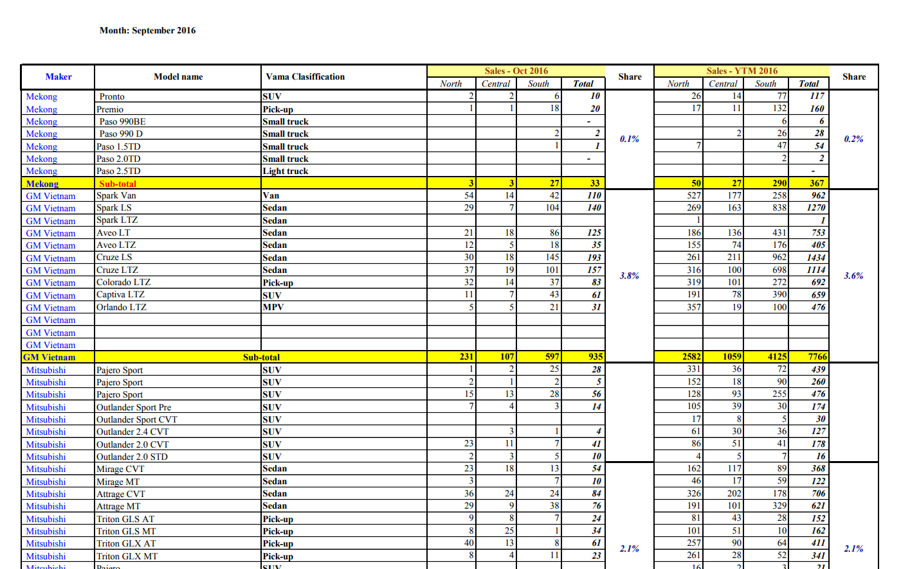
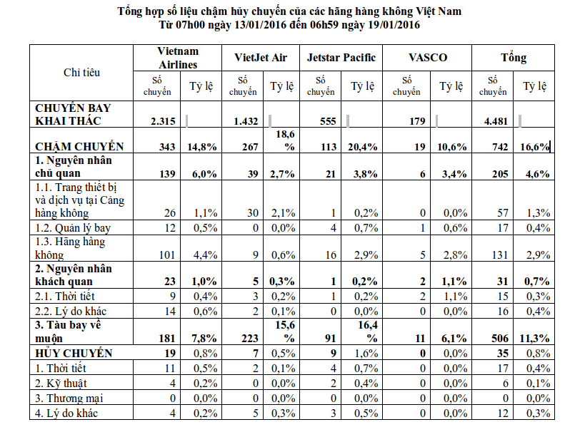
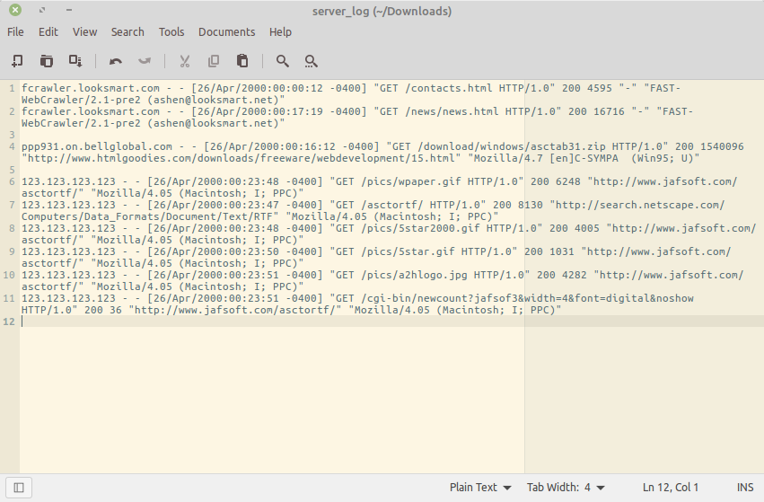

```{r setup, include=FALSE}
options(htmltools.dir.version = FALSE)
knitr::opts_chunk$set(comment = "R>", message = FALSE, warning = FALSE)
library(readr)
library(tidyr)
library(dplyr)
```


background-image: url(hex-tidyr.png)
background-size: contain

---

# What you wish data looked like



---

# What it actually looks like



---

# What it actually looks like



---

# What it actually looks like



---

# What it actually looks like



---
background-image: url(disappointed.gif)
background-size: 100% 80%
class: inverse, center, middle

---
class: left, middle

.h9[Happy families are all alike; every unhappy family is unhappy in its own way]

> .h9[.grayfont[Leo Tolstoy]]


---
class: left, middle

.h9[.greenfont[Tidy] datasets are all alike; every .greenfont[messy] dataset is .greenfont[messy] in its own way]

> .h9[.grayfont[Hadley Wickham]]

---
background-image: url(tidy_data_paper.png)
background-size: contain

---

# Tidy data principles

.huge[1 - Each variable forms a column]

<br>

.huge[2 - Each observation forms a row]

<br>

.huge[3 - Each type of observational unit forms a table]

--

.huge[==> A standardized way to link the structure of a dataset (its physical layout)
with its semantics (its meaning)]


---
class: center, middle

.h9[Data semantics]

---
background-image: url(data_semantics1.png)
background-size: contain


---
background-image: url(data_semantics2.png)
background-size: contain

---
background-image: url(data_semantics3.png)
background-size: contain

---
background-image: url(data_semantics4.png)
background-size: contain

---
background-image: url(data_semantics5.png)
background-size: contain

---
background-image: url(data_semantics6.png)
background-size: contain

---
background-image: url(data_semantics7.png)
background-size: contain

---
background-image: url(data_semantics8.png)
background-size: contain

---

# Data semantics

--

.large[A dataset is a collection of .grayfont[.bold[values]] (numbers or strings)]

--

<br>

.large[Every value belongs to a .grayfont[.bold[variable]] and an .grayfont[.bold[observation]]]

--

<br>

.large[A .grayfont[.bold[variable]] contains all values that measure the same underlying
attribute across observations]

--

<br>

.large[An .grayfont[.bold[observation]] contains all values measured on the same 
unit across variables]

---
class: center, middle

.h9[Data sets]

.h9[http://bit.ly/2lqjv5r]


---

# Your turn

.large[Open `data_tidying.R`]

---

# Common problems


- .large[Column headers are values, not variable names]

<br>

- .large[Multiple variables are stored in one column]

<br>

- .large[Variables are stored in both rows and columns]


???

- Most people aren’t familiar with the principles of tidy data, and it’s hard to
derive them yourself unless you spend a lot of time working with data.

- Data is often organised to facilitate some use other than analysis. For example,
data is often organised to make entry as easy as possible.

---

# Solutions

- .huge[`gather()`]

<br>

- .huge[`spread()`]

<br>

- .huge[`separate()`]

<br>

- .huge[`unite()`]


---

# Common problems


- .large[.greenfont[.bold[Column headers are values, not variable names]]]

<br>

- .large[Multiple variables are stored in one column]

<br>

- .large[Variables are stored in both rows and columns]

<br>


---

```{r}
diemthi <- read_csv("diemthi_tslop10.csv")
diemthi
```


---
background-image: url(gather.png)
background-size: 75%
class: center

# gather(data, key, value, ...)


---

```{r}
diemthi <- read_csv("diemthi_tslop10.csv")
diemthi_tidy <- gather(diemthi, key = "mon", value = "diem",
                       van, ngoaingu, toan)
```

.pull-left[
```{r}
diemthi
```
]

.pull-right[
```{r}
diemthi_tidy
```
]

---

# Your turn

<br>

.huge[Inspect the `forest fire` data (`forest_fires.csv`) and turn it into
a tidy dataset]

.huge[Hint: read_csv(..., skip = ...)]

---

# Solution

```{r}
forest_fire <- read_csv("forest_fires.csv", skip = 2)

forest_fire <- gather(forest_fire, key = "year", value = "area", 
                      Y1995:Y2016)

# clean `year` and `area`
forest_fire <- mutate(forest_fire, year = gsub("Y", "", year))
forest_fire <- mutate(forest_fire, 
                      area = ifelse(area == "..", NA, area))

head(forest_fire)
```

---

# Common problems


- .large[Column headers are values, not variable names]

<br>

- .large[.greenfont[.bold[Multiple variables are stored in one column]]]

<br>

- .large[Variables are stored in both rows and columns]


---
background-image: url(separate.png)
background-size: contain
class: center

# separate(data, col, into, sep, ...)

---

```{r, eval=TRUE}
airport_gps <- read_csv("airports_gps.csv")
head(select(airport_gps, icao, gps, name))

airport_gps_tidy <- separate(airport_gps, 
                             col = "gps", into = c("lon", "lat"),
                             sep = "/")
head(select(airport_gps_tidy, icao, lon, lat, name))
```


---

```{r, eval=FALSE}
airport_gps_tidy$lon <- as.double(airport_gps_tidy$lon)
airport_gps_tidy$lat <- as.double(airport_gps_tidy$lat)

vnm <- get_map("vietnam", zoom = 5)

ggmap(vnm) +
    geom_point(data = airport_gps_tidy,
               aes(lon, lat),
               color = "brown", size = 3)
```

---
background-image: url(airport_map.svg)
background-size: cover
class: center, middle

---

# Your turn

.large[Tidy up the OECD Teacher Salary data (`oecd_teacher_salary.csv`)]

---

# Solutioin

```{r}
salary <- read_csv("oecd_teacher_salary.csv")

salary <- separate(salary, 
                   col = "subject", 
                   into = c("school_level", "year_exp"), 
                   sep = "_")

head(salary)
```

---

# Common problems

- .large[Column headers are values, not variable names]

<br>

- .large[Multiple variables are stored in one column]

<br>

- .large[.greenfont[.bold[Variables are stored in both rows and columns]]]


---
background-image: url(spread.png)
background-size: 80%
class: center

# spread(data, key, value)

---
background-image: url(unite.png)
background-size: contain
class: center

# unite(data, col, ..., sep)

---

```{r}
sales_kpi <- read_csv("sales_kpi.csv")

sales_kpi

```


```{r, eval=FALSE}
# Expected output:
   period   year month quater profit revenue
   <chr>   <int> <int> <chr>   <int>   <int>
 1 10/2017  2017    10 1          18     178
 2 10/2017  2017    10 2          14     114
 3 10/2017  2017    10 3          13     100
 4 10/2017  2017    10 4           7     100
 5 11/2017  2017    11 1          20     132
 6 11/2017  2017    11 2          20     123
```


---

```{r}
sales_kpi <- gather(sales_kpi, 
                    key = "quater", 
                    value = "amount", 
                    q1:q4)
sales_kpi
```

---

```{r}
sales_kpi <- unite(sales_kpi, col = "period",
                   month, year, sep = "/", remove = FALSE)
sales_kpi
```


---

```{r}
sales_kpi <- spread(sales_kpi, key = "kpi", value = "amount")

sales_kpi
```


---

```{r}
sales_kpi <- mutate(sales_kpi, quater = gsub("q", "", quater))

sales_kpi
```


---

# Your turn

.large[Inspect the Hanoi Temperature data (`hanoi_temp_wideform.csv`) and reshape
it into tidy data format]

.large[Expected output:]

```{r, eval=FALSE}
   day        year month date  max_temp min_temp
 * <chr>     <int> <int> <chr>    <int>    <int>
 1 2015-1-1   2015     1 1           24       11
 2 2015-1-10  2015     1 10          13       12
 3 2015-1-11  2015     1 11          15       12
 4 2015-1-12  2015     1 12          20        9
 5 2015-1-13  2015     1 13          20        9
 6 2015-1-14  2015     1 14          20       10
```


---

# Solution

```{r, eval=TRUE}
weather <- read_csv("hanoi_temp_wideform.csv")

weather <- gather(weather, key = "date", value = "temp", d1:d31)

weather <- spread(weather, key = "temp_level", value = "temp")

weather <- mutate(weather, date = gsub("d", "", date))

weather <- unite(weather, col = "day", year, month, date, 
                 sep = "-", remove = FALSE)

weather
```

---

# Final challenge

```{r, eval=FALSE}
dat <- read_csv("so3.csv")
print(dat)
```

```{r, eval=FALSE}
#   Person Time Score1 Score2 Score3
# 1   greg  Pre     80     78   84.0
# 2   greg Post     79     80   84.5
# 3  sally  Pre     75     74   79.5
# 4  sally Post     78     78   83.0
# 5    sue  Pre     81     78   84.5
# 6    sue Post     82     81   86.5
```

.large[Expected output:]

```{r, eval=FALSE}
#   Person Pre.Score1 Pre.Score2 Pre.Score3  Post.Score1 Post.Score2 Post.Score3
# 1   greg         80         78       84.0           79          80        84.5
# 2  sally         75         74       79.5           78          78        83.0
# 3    sue         81         78       84.5           82          81        86.5

# Hint: `?unite`
```

???

https://stackoverflow.com/questions/29775461/how-can-i-spread-repeated-measures-of-multiple-variables-into-wide-format

---

# Solution

```{r, eval=FALSE}
dat %>%
    gather(temp, score, starts_with("Score")) %>%
    unite(temp1, Time, temp, sep = ".") %>%
    spread(temp1, score)
```

---
background-image: url(bravo.gif)
background-size: 100% 80%
class: inverse, center, middle

---
background-image: url(so3.png)
background-size: contain

---
class: inverse, center, middle

.h0[Wrap-up]


---

# Why tidy data

- .large[Well-suited for R's vectorized programming nature]

<br>

- .large[Consistent structure => easier to reason about data + easier to 
learn/combine other tools]

???

Non-tidy data:

- Alternative representations may have substantial performance or space advantages.

- Specialised fields have evolved their own conventions for storing data that may 
be quite different to the conventions of tidy data.

---
background-image: url(tidytool_manifesto.png)
background-size: contain

---
background-image: url(tidyverse.png)
background-size: contain

---

# Data organization

<br>

<br>

<br>

.h9[.center[.grayfont[Analysis vs. Presentation]]]

---
background-image: url(data_org_excel.png)
background-size: contain


---

# How to share data for collaboration


---

# How to share data for collaboration

<br>

--

.large[1 - The raw data]

--

<br>
.large[2 - A tidy data set]

--

<br>
.large[3 - A code book describing each variable and its values in the tidy data set]

--

<br>
.large[4 - An explicit and exact recipe you used to go from 1 -> 2,3]

---
class: inverse, center, middle

.h0[Q&A]


