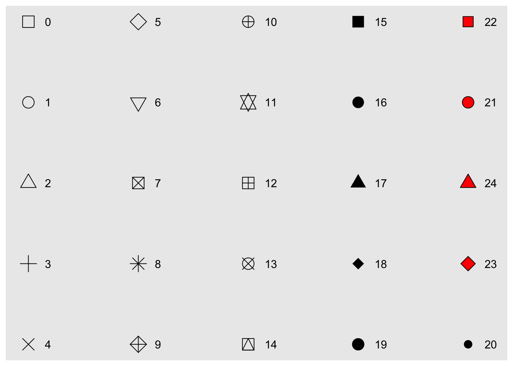

```{r setup, include=FALSE}
options(htmltools.dir.version = FALSE)
knitr::opts_chunk$set(comment = "", message = FALSE, warning = FALSE, dev = "svg", fig.align = "center")
library(readr)
library(dplyr)
library(ggplot2)
```

background-image: url(hex-ggplot2.png)
background-size: contain

---
background-image: url(facebook.jpg)
background-size: contain

???

https://www.facebook.com/notes/facebook-engineering/visualizing-friendships/469716398919

---
background-image: url(ggplot2_thematicmap.png)
background-size: contain

???

https://timogrossenbacher.ch/2016/12/beautiful-thematic-maps-with-ggplot2-only/


---
background-image: url(population_lines_sml.jpg)
background-size: contain

???

http://spatial.ly/2014/08/population-lines/
http://spatial.ly/2017/04/population-lines-how-and-why-i-created-it/

---
background-image: url(ggplot2_qz.png)
background-size: contain

???

https://qz.com/1007328/all-hail-ggplot2-the-code-powering-all-those-excellent-charts-is-10-years-old/

---
background-image: url(ggplot2_FT.png)
background-size: contain

???

http://johnburnmurdoch.github.io/slides/r-ggplot/#/


---
class: center, middle

<iframe src="https://channel9.msdn.com/Events/useR-international-R-User-conference/useR2016/FiveThirtyEights-data-journalism-workflow-with-R/player" width="960" height="540" allowFullScreen frameBorder="0"></iframe>

---

# Your turn

.large[Discuss with your colleagues:]

.large[What's your current/favorite tool of data visualisation?]


---
class: inverse, center, middle

.h0[ggplot2 background]

---

# Grammar of graphics

.pull-left[

- .large[Leland Wilkinson, 1999]

- .large[Plotting framework]

- .large[Statistical graphics are composed of different grammatical layers]
]

.pull-right[

]

---

# ggplot2

.pull-left[

- .large[Hadley Wickham, 2007]

- .large[Implementation of grammar of graphics in R]

- .large[A mini-language specifically tailored for producing graphics]

]

.pull-right[


]

---
background-image: url(ggplot2_layers.jpg)
background-size: 60%

# Grammartical elements


---
class: inverse, center, middle

.h0[Demo]

---
class: center, middle

.h9[Data sets]

.h9[http://bit.ly/2lqjv5r]

---

# Hanoi Air Quality Data

```{r}
air_quality <- read_csv("air-quality.csv")
weather <- read_csv("hanoi_weather_history.csv")

air_quality <- air_quality %>%
    group_by(date, year, month, day) %>%
    summarise(avg_aqi = mean(aqi, na.rm = TRUE)) %>%
    ungroup() %>%
    left_join(
        select(weather, date, min_temp, max_temp, 
               max_steady_wind, description)
        )

air_quality <- air_quality %>%
    mutate(month = factor(month),
           year = factor(year),
           day = factor(day))
```

---

```{r}
air_quality
```


---

# Your turn

.large[Discuss with your colleagues:]

.large[What questions do you want to answer from this data set?]

.large[Open `ggplot2_vis.R`]


---

# ggplot2 layers - Data

.large[The **data** being plotted.]

.large[ggplot2 loves tidy data.]


---

```{r, eval=FALSE}
ggplot(data = air_quality)
```

```{r, out.width="70%", out.height="70%", echo=FALSE}
ggplot(data = air_quality)
```

---

# ggplot2 layers - Aesthetics

.large[A mapping that describes how variables in the data are linked to 
**aes**thetic attributes, such as position, color, size, shape, ...]


---

```{r, eval=FALSE}
ggplot(data = air_quality, aes(x = min_temp, y = avg_aqi))
```

```{r, out.width="70%", out.height="70%", echo=FALSE}
ggplot(data = air_quality, aes(x = min_temp, y = avg_aqi)) +
    theme(text = element_text(size = 16))
```


---

```{r, eval=FALSE}
p1 <- ggplot(data = air_quality, aes(x = min_temp, y = avg_aqi))
p1
```

```{r, out.width="70%", out.height="70%", echo=FALSE}
p1 <- ggplot(data = air_quality, aes(x = min_temp, y = avg_aqi)) +
    theme(text = element_text(size = 16))
p1
```

---

# ggplot2 layers - Geometries

.large[Geometric shapes, **geom** for short, represent what you actually see on
the plot: points, lines, polygons, ...]


---

```{r, eval=FALSE}
p2 <- p1 + geom_point(alpha = 0.6)
p2
```

```{r, out.width="70%", out.height="70%", echo=FALSE}
p2 <- p1 + geom_point(size = 2, alpha = 0.6)
p2
```

---

# ggplot2 layers - Facets

.large[A **face**ting specification describes how to visualise the data into subsets.]


---

```{r, eval=FALSE}
p3 <- p2 + facet_wrap(~ month)
p3
```

```{r, out.width="70%", out.height="70%", echo=FALSE}
p3 <- p2 + facet_wrap(~ month)
p3
```

---
background-image: url(https://media1.tenor.com/images/e51d16dd6ad5a5762631a3dddff7c6e9/tenor.gif?itemid=7561108)
background-size: contain
class: inverse, center, top


# How about that?

---

# ggplot2 layers - Statistics

.large[Statistical transformations, **stat** for short, of the data that can
be plotted such as quantiles, fitted curves,...]


---

```{r, eval=FALSE}
p4 <- p3 + geom_smooth(method = "lm", se = FALSE, color = "red")
p4
```

```{r, out.width="70%", out.height="70%", echo=FALSE}
p4 <- p3 + geom_smooth(method = "lm", se = FALSE, color = "red")
p4
```

---
background-image: url(https://media1.tenor.com/images/9b2e7fd615836d4d684f46957b2ff7ac/tenor.gif?itemid=9085691)
background-size: contain
class: inverse, center, top

# Awesome?

---

# ggplot2 layers - Coordinates

.large[A coordinate system, **coord** for short, describes how data coordinates are
mapped to the plane of the graphic.]


---

```{r, eval=FALSE}
p5 <- p4 + coord_cartesian(xlim = c(5, 32),  ylim = c(25, 200))
p5
```

```{r, out.width="70%", out.height="70%", echo=FALSE}
p5 <- p4 + coord_cartesian(xlim = c(5, 32),  ylim = c(25, 200))
p5
```


---

# ggplot2 layers - Themes

.large[A **theme** which controls the finer points of display, like the font size and
background colour, ...]


---

```{r, eval=FALSE}
p6 <- p5 + theme_minimal() + labs(x = "Min temp (C)", y = "AQI") +
    theme(strip.text = element_text(face = "bold"))
p6
```


```{r, out.width="67%", out.height="67%", echo=FALSE}
p6 <- p5 + theme_minimal() + labs(x = "Min temp (C)", y = "AQI") +
    theme(text = element_text(size = 16)) +
    theme(strip.text = element_text(face = "bold"))
p6
```

---

# Wrap-up

```{r, eval=FALSE}
ggplot(data = air_quality, aes(x = min_temp, y = avg_aqi)) +
    geom_point(alpha = 0.6) +
    facet_wrap(~ month) +
    geom_smooth(method = "lm", se = FALSE, color = "red") +
    coord_cartesian(xlim = c(5, 32),  ylim = c(25, 200)) +
    theme_minimal() + 
    labs(x = "Min temp (C)", y = "AQI") +
    theme(strip.text = element_text(face = "bold"))
```

---
background-image: url(roeder-wine-5.png)
background-size: contain

???

https://fivethirtyeight.com/features/the-weird-world-of-expensive-wine/


---
class: inverse, center, middle

.h0[Mappings]


---

# Recall

```{r, out.width="50%", out.height="50%", eval=FALSE}
# position mapping
ggplot(air_quality, aes(x = min_temp, y = avg_aqi)) +
    geom_point()
```


```{r, out.width="55%", out.height="55%", echo=FALSE}
ggplot(air_quality, aes(x = min_temp, y = avg_aqi)) +
    geom_point(size = 3) +
    theme(text = element_text(size = 16))
```

---

# Typical aesthetics

- .large[**color**: color of dots, outlines of other shapes]

- .large[**size**: diameter of points, thickness of lines]

- .large[**shape**: shape]

- .large[**alpha**: transparency]

- .large[**fill**: fill color]

- .large[**linetype**: line dash pattern]


---
background-image: url(common-aesthetics.png)
background-size: contain
class: center, middle

---

# Color/Fill

```{r}
head(colors(), 30) # print out the first 30 colors
```

.large[Google "colors in R"]

---

# Shape



---

# Linetype


---

```{r, out.width="70%", out.height="70%", eval=FALSE}
ggplot(air_quality, aes(x = min_temp, y = avg_aqi)) +
    geom_point(color = "#CC3300")
```

```{r, out.width="70%", out.height="70%", echo=FALSE}
ggplot(air_quality, aes(x = min_temp, y = avg_aqi)) +
    geom_point(color = "#CC3300") +
    theme(text = element_text(size = 16))
```

---

```{r, out.width="70%", out.height="70%", eval=FALSE}
ggplot(air_quality, aes(x = min_temp, y = avg_aqi)) +
    geom_point(size = 3, alpha = 0.6, color = "#003366", shape = 19)
```

```{r, out.width="70%", out.height="70%", echo=FALSE}
ggplot(air_quality, aes(x = min_temp, y = avg_aqi)) +
    geom_point(size = 3, alpha = 0.6, color = "#003366", shape = 19) +
    theme(text = element_text(size = 16))
```

---

# Your turn

.large[Add color, size, alpha, and shape aesthetics to the following code chunk:]

<br>

```{r, eval=FALSE}
ggplot(air_quality, aes(max_steady, avg_aqi)) +
    geom_point(
        # your code goes here
        ......
        )
```

---

```{r, out.width="70%", out.height="70%", eval=FALSE}
ggplot(air_quality, aes(max_steady_wind, avg_aqi)) +
    geom_point(alpha = 0.5, size = 4, shape = 21,
               color = "white", fill = "#993399")
```

```{r, out.width="70%", out.height="70%", echo=FALSE}
ggplot(air_quality, aes(max_steady_wind, avg_aqi)) +
    geom_point(alpha = 0.5, size = 4, shape = 21,
               color = "white", fill = "#993399") +
    theme(text = element_text(size = 16))
```

---
class: center, middle

.h9[Set vs. Map]

---

```{r, out.width="70%", out.height="70%", eval=FALSE}
ggplot(air_quality, aes(x = min_temp, y = avg_aqi)) +
    geom_point(color = "#001A57")
```

```{r, out.width="70%", out.height="70%", echo=FALSE}
ggplot(air_quality, aes(x = min_temp, y = avg_aqi)) +
    geom_point(color = "#001A57") +
    theme(text = element_text(size = 16))
```

---

```{r, out.width="70%", out.height="70%", eval=FALSE}
ggplot(air_quality, aes(min_temp, avg_aqi, color = year)) + 
    geom_point()
```


```{r, out.width="70%", out.height="70%", echo=FALSE}
ggplot(air_quality, aes(min_temp, avg_aqi, color = year)) + 
    geom_point() +
    theme(text = element_text(size = 16))
```

---

# Set vs. Map

- .large[**outside of aes()**: sets an aesthetic to a value]

```{r, eval=FALSE}
ggplot(air_quality, aes(x = min_temp, y = avg_aqi)) +
    geom_point(color = "#001A57")
```

- .large[**inside of aes()**: maps an aesthetic to a variable]

```{r, eval=FALSE}
ggplot(air_quality, aes(min_temp, avg_aqi, color = year)) + 
    geom_point()
```

---

# Set


---

# Map


---

# Common mistake

```{r, out.width="60%", out.height="60%", eval=FALSE}
ggplot(air_quality, aes(min_temp, avg_aqi, color = "#001A57")) + 
    geom_point()
```

```{r, out.width="60%", out.height="60%", echo=FALSE}
ggplot(air_quality, aes(x = min_temp, y = avg_aqi, color = "#001A57")) + 
    geom_point() +
    theme(text = element_text(size = 16))
```

---

# Your turn

.large[Add color, size, alpha, and shape aesthetics to the following code chunk. 
For this time, try to map visual aesthetics to discrete and/or continuous variables.]

.large[What happens?]

```{r, eval=FALSE}
ggplot(air_quality, aes(max_steady_wind, avg_aqi, 
                        # your code goes here
                        .........
                        )) +
    geom_point()
```

---

# Mappings - categorical variables

```{r, out.width="60%", out.height="60%", eval=FALSE}
ggplot(air_quality, aes(min_temp, avg_aqi, color = year)) + 
    geom_point()
```


```{r, out.width="60%", out.height="60%", echo=FALSE}
ggplot(air_quality, aes(min_temp, avg_aqi, color = year)) + 
    geom_point() +
    theme(text = element_text(size = 16))
```

---

# Mappings - continuous variables

```{r, out.width="60%", out.height="60%", eval=FALSE}
air_quality %>% mutate(year = as.numeric(as.character(year))) %>% 
    ggplot(aes(min_temp, avg_aqi, color = year) + geom_point()
```


```{r, out.width="60%", out.height="60%", echo=FALSE}
air_quality %>% 
    mutate(year = as.numeric(as.character(year))) %>% 
    ggplot(aes(min_temp, avg_aqi, color = year)) + 
    geom_point() +
    theme(text = element_text(size = 16))
```

---
class: inverse, center, middle

.h0[Geoms]


---
background-image: url(cheasheet.png)
background-size: contain

# ggplot2 cheatsheet

---

# Your turn

.large[With your colleagues, discuss how to draw the scatterplot and boxplot of
two variables `month` and `avg_aqi`?]

.large[You can use the cheatsheet.]

---

```{r, out.width="70%", out.height="70%", eval=FALSE}
ggplot(air_quality, aes(month, avg_aqi)) +
    geom_point()
```

```{r, out.width="70%", out.height="70%", echo=FALSE}
ggplot(air_quality, aes(month, avg_aqi)) +
    geom_point() +
    theme(text = element_text(size = 16))
```

---

```{r, out.width="70%", out.height="70%", eval=FALSE}
ggplot(air_quality, aes(month, avg_aqi)) +
    geom_boxplot()
```

```{r, out.width="70%", out.height="70%", echo=FALSE}
ggplot(air_quality, aes(month, avg_aqi)) +
    geom_boxplot() +
    theme(text = element_text(size = 16))
```

---
exclude: TRUE


```{r, out.width="70%", out.height="70%", eval=FALSE}
ggplot(air_quality, aes(month, avg_aqi)) +
    geom_violin()
```

```{r, out.width="70%", out.height="70%", echo=FALSE}
ggplot(air_quality, aes(month, avg_aqi)) +
    geom_violin() +
    theme(text = element_text(size = 16))
```

---

# Your turn

.large[With your colleague, make the histogram of `avg_aqi`?]

.large[You can use the cheatsheet.]

---

```{r, out.width="70%", out.height="70%", eval=FALSE}
ggplot(air_quality, aes(x = avg_aqi)) +
    geom_histogram(color = "white")
```

```{r, out.width="70%", out.height="70%", echo=FALSE}
ggplot(air_quality, aes(x = avg_aqi)) +
    geom_histogram(color = "white") +
    theme(text = element_text(size = 16))
```


---

```{r, out.width="70%", out.height="70%", eval=FALSE}
ggplot(air_quality, aes(x = avg_aqi)) +
    geom_histogram(color = "white", bins = 50) # default  =30
```

```{r, out.width="70%", out.height="70%", echo=FALSE}
ggplot(air_quality, aes(x = avg_aqi)) +
    geom_histogram(color = "white", bins = 50) +
    theme(text = element_text(size = 16))
```

---

```{r, out.width="70%", out.height="70%", eval=FALSE}
ggplot(air_quality, aes(x = avg_aqi)) +
    geom_histogram(color = "white", binwidth = 3)
```

```{r, out.width="70%", out.height="70%", echo=FALSE}
ggplot(air_quality, aes(x = avg_aqi)) +
    geom_histogram(color = "white", binwidth = 3) +
    theme(text = element_text(size = 16))
```

---

# Your turn

.large[Make the density plot of `avg_aqi` colored by `month`.]

```{r, out.width="60%", out.height="60%", echo=FALSE}
ggplot(air_quality, aes(x = avg_aqi, color = month)) +
    geom_density() +
    theme(text = element_text(size = 16))
```


---

```{r, out.width="70%", out.height="70%", eval=FALSE}
ggplot(air_quality, aes(x = avg_aqi)) +
    geom_density()
```


```{r, out.width="70%", out.height="70%", echo=FALSE}
ggplot(air_quality, aes(x = avg_aqi)) +
    geom_density() +
    theme(text = element_text(size = 16))
```


---

```{r, out.width="70%", out.height="70%", eval=FALSE}
ggplot(air_quality, aes(x = avg_aqi, color = month)) +
    geom_density()
```


```{r, out.width="70%", out.height="70%", echo=FALSE}
ggplot(air_quality, aes(x = avg_aqi, color = month)) +
    geom_density() +
    theme(text = element_text(size = 16))
```

---
exclude: true

```{r, out.width="70%", out.height="70%", eval=FALSE}
ggplot(air_quality, aes(x = avg_aqi, group = month)) +
    geom_density()
```


```{r, out.width="70%", out.height="70%", echo=FALSE}
ggplot(air_quality, aes(x = avg_aqi, group = month)) +
    geom_density() +
    theme(text = element_text(size = 16))
```


---
class: center, middle

.h9[global vs. local]


---

# Your turn

.large[Predict what this code will do]

.large[Then run it]

```{r, eval=FALSE}
ggplot(air_quality) +
    geom_point(aes(min_temp, avg_aqi)) +
    geom_line(aes(min_temp, avg_aqi))
```

---

```{r, out.width="70%", out.height="70%", eval=FALSE}
ggplot(air_quality) +
    geom_point(aes(min_temp, avg_aqi)) +
    geom_line(aes(min_temp, avg_aqi))
```


```{r, out.width="70%", out.height="70%", echo=FALSE}
ggplot(air_quality) +
    geom_point(aes(min_temp, avg_aqi)) +
    geom_line(aes(min_temp, avg_aqi)) +
    theme(text = element_text(size = 16))
```

---

```{r, out.width="70%", out.height="70%", eval=FALSE}
ggplot(air_quality, aes(min_temp, avg_aqi)) +
    geom_point() +
    geom_line()
```


```{r, out.width="70%", out.height="70%", echo=FALSE}
ggplot(air_quality, aes(min_temp, avg_aqi)) +
    geom_point() +
    geom_line() +
    theme(text = element_text(size = 16))
```

---

```{r, out.width="70%", out.height="70%", eval=FALSE}
ggplot(air_quality, aes(min_temp, avg_aqi)) +
    geom_point(aes(color = month)) +
    geom_line()
```


```{r, out.width="70%", out.height="70%", echo=FALSE}
ggplot(air_quality, aes(min_temp, avg_aqi)) +
    geom_point(aes(color = month)) +
    geom_line() +
    theme(text = element_text(size = 16))
```

---

```{r, out.width="70%", out.height="70%", eval=FALSE}
ggplot(air_quality, aes(min_temp, avg_aqi)) +
    geom_point(aes(color = month)) +
    geom_line(data = filter(air_quality, min_temp < 20))
```


```{r, out.width="70%", out.height="70%", echo=FALSE}
ggplot(air_quality, aes(min_temp, avg_aqi)) +
    geom_point(aes(color = month)) +
    geom_line(data = filter(air_quality, min_temp < 20)) +
    theme(text = element_text(size = 16))
```

---

# Your turn

.large[Draw two time series plots of the following variables:]

.large[From air quality data]

- .large[aqi]

.large[From weather history data]

- .large[min_temp]

---

```{r, out.width="70%", out.height="70%", eval=FALSE}
ggplot(air_quality, aes(date, avg_aqi)) +
    geom_line()
```


```{r, out.width="70%", out.height="70%", echo=FALSE}
ggplot(air_quality, aes(date, avg_aqi)) +
    geom_line() +
    theme(text = element_text(size = 16))
```

---

```{r, out.width="70%", out.height="70%", eval=FALSE}
ggplot(weather, aes(date, min_temp)) +
    geom_line()
```


```{r, out.width="70%", out.height="70%", echo=FALSE}
ggplot(weather, aes(date, min_temp)) +
    geom_line() +
    theme(text = element_text(size = 16))
```


---
exclude: true

# Heatmap

```{r, eval=FALSE}
ggplot(air_quality, aes(day, month, fill = avg_aqi)) +
    geom_tile()
```

```{r, out.width="60%", out.height="60%", echo=FALSE}
air_quality %>% 
    group_by(day, month) %>% 
    summarise(avg_aqi = median(avg_aqi, na.rm= TRUE)) %>% 
    ungroup() %>% 
    ggplot(aes(day, month, fill = avg_aqi)) +
    geom_tile() +
    theme(text = element_text(size = 16))
```

---

# A graph template

<hr>
.huge[.scp[ ggplot(data = .greenfont[{DATA}]) + ]]
<br>
.huge[.scp[ .greenfont[{GEOM_FUNCTION}](aes(.greenfont[{MAPPINGS}])) ]]
<hr>

--

.huge[1 - Pick a .bold[.greenfont[data]] set]

--

.huge[2 - Choose a .bold[.greenfont[geom]] to display cases]

--

.huge[3 - .bold[.greenfont[Map]] aesthetic properties to variables]


---
class: inverse, center, middle

.h0[Facets]


---

# Facetting

--

- .large[Another way of visualising **multi-dimensional** data set]

--

<br>

- .large[By generating **small multiples** showing different subset of the data]


--

<br>

- .large[*Visualization of Quantitative Information, Edward Tufte, 1983*]


---

# Facets


---

```{r, out.width="70%", out.height="70%", eval=FALSE}
# facet_wrap(~ categ_variable) - 1d 
ggplot(air_quality, aes(min_temp, avg_aqi)) +
    geom_point() + facet_wrap(~ description)
```


```{r, out.width="70%", out.height="70%", echo=FALSE}
ggplot(air_quality, aes(min_temp, avg_aqi)) +
    geom_point() + 
    facet_wrap(~ description) +
    theme(text = element_text(size = 16))
```


---

```{r, out.width="70%", out.height="70%", eval=FALSE}
# facet_wrap(~ categ_variable) - 1d 
ggplot(air_quality, aes(min_temp, avg_aqi)) +
    geom_point() + facet_wrap(~ description, nrow = 3)
```


```{r, out.width="70%", out.height="70%", echo=FALSE}
ggplot(air_quality, aes(min_temp, avg_aqi)) +
    geom_point() + 
    facet_wrap(~ description, nrow = 3) +
    theme(text = element_text(size = 16))
```


---


```{r, out.width="70%", out.height="70%", eval=FALSE}
# facet_wrap(row ~ col) - 2d 
ggplot(air_quality, aes(min_temp, avg_aqi)) +
    geom_point() + facet_grid(year ~ month)
```


```{r, out.width="70%", out.height="70%", echo=FALSE}
ggplot(air_quality, aes(min_temp, avg_aqi)) +
    geom_point() + facet_grid(year ~ month) +
    theme(text = element_text(size = 16))
```


---

# Your turn

.large[With your colleague,]

.large[Explore the relationship of `aqi` and `max_steady_wind`:]

- .large[across `month` (hint: facet_wrap())] 

- .large[across `year` and `month` (hint: facet_grid())]


---

```{r, out.width="70%", out.height="70%", eval=FALSE}
ggplot(air_quality, aes(max_steady_wind, avg_aqi)) +
    geom_point() + facet_wrap(~ month)
```


```{r, out.width="70%", out.height="70%", echo=FALSE}
ggplot(air_quality, aes(max_steady_wind, avg_aqi)) +
    geom_point() +
    facet_wrap(~ month) +
    theme(text = element_text(size = 16))
```

---

```{r, out.width="70%", out.height="70%", eval=FALSE}
ggplot(air_quality, aes(max_steady_wind, avg_aqi)) +
    geom_point() + facet_grid(year ~ month)
```


```{r, out.width="70%", out.height="70%", echo=FALSE}
ggplot(air_quality, aes(max_steady_wind, avg_aqi)) +
    geom_point() +
    facet_grid(year ~ month) +
    theme(text = element_text(size = 16))
```


---

# Your turn

.large[With your colleague,]

.large[Explore the relationship of `aqi` and `max_steady_wind`:]

- .large[across `month` (this time, use **facet_grid()**)] 

- .large[across `year` and `month` (this time, use **facet_wrap()**)]


---

```{r, out.width="70%", out.height="70%", eval=FALSE}
ggplot(air_quality, aes(max_steady_wind, avg_aqi)) +
    geom_point() + facet_grid(. ~ month)
```


```{r, out.width="70%", out.height="70%", echo=FALSE}
ggplot(air_quality, aes(max_steady_wind, avg_aqi)) +
    geom_point() +
    facet_grid(. ~ month)
    theme(text = element_text(size = 16))
```


---

```{r, out.width="70%", out.height="70%", eval=FALSE}
ggplot(air_quality, aes(max_steady_wind, avg_aqi)) +
    geom_point() + facet_grid(month ~ .)
```


```{r, out.width="70%", out.height="70%", echo=FALSE}
ggplot(air_quality, aes(max_steady_wind, avg_aqi)) +
    geom_point() +
    facet_grid(month ~ .) +
    theme(text = element_text(size = 16))
```


---

```{r, out.width="70%", out.height="70%", eval=FALSE}
ggplot(air_quality, aes(max_steady_wind, avg_aqi)) +
    geom_point() + facet_wrap(year ~ month)
```


```{r, out.width="70%", out.height="70%", echo=FALSE}
ggplot(air_quality, aes(max_steady_wind, avg_aqi)) +
    geom_point() +
    facet_wrap(year ~ month) +
    theme(text = element_text(size = 16))
```


---
class: inverse, center, middle

.h0[Annotation]

---

# Annotation

- .large[Title]

- .large[Subtitle]

- .large[Axis labels]

- .large[Source]

- .large[Caption]

- .large[User guide]


---
background-image: url(share-world-population-in-extreme-poverty-absolute.png)
background-size: contain

---

```{r, out.width="60%", out.height="60%", eval=FALSE}
p + labs(title = "Scatter plot of AQI and Temperature in Hanoi",
         subtitle = "Daily measurement from 2015 to 2017",
         x = "Min Temperature (Ceilcus)",
         y = "Air Quality Index")
```

```{r, out.width="60%", out.height="60%", echo=FALSE}
ggplot(air_quality, aes(x = min_temp, y = avg_aqi)) +
    geom_point(size = 3, alpha = 0.6, color = "#003366") +
    labs(title = "Scatter plot of AQI and Temperature in Hanoi",
         subtitle = "Daily measurement from 2015 to 2017",
         x = "Min Temperature (Ceilcus)",
         y = "Air Quality Index") +
    theme(text = element_text(size = 16))
```


---
class: inverse, center, middle

.h0[Saving graphs]


---

# Manually saving plots


---

# Saving plots

- .large[`ggsave()` saves the last plot.]

- .large[if the plot is on your screen]

```{r, eval=FALSE}
ggsave(filename = "~/path/to/figures/plot.pdf")
```

- .large[If your plot is assigned to an object (e.g. my_plot)]

```{r, eval=FALSE}
ggsave(my_plot, filename = "~/path/to/figures/plot.pdf")
```

---

# Saving plots

- .large[Specify a size:]

```{r, eval=FALSE}
ggsave("~/path/to/figures/plot.pdf",
       width = 6, height = 6, units = "in") # others: cm, mm
```

- .large[Pick any format for your plot:]

```{r, eval=FALSE}
ggsave(filename = "~/path/to/figures/plot.png")
ggsave(filename = "~/path/to/figures/plot.jpg")
ggsave(filename = "~/path/to/figures/plot.eps")
```


---

# Your turn

<br>

.large[Save your last plot and then open it from your `Files` pane]


---

# [aqivn.org](http://www.aqivn.org/vi/)


---

# Your turn

.large[Replicate the following graph:]


---
class: inverse, center, middle


.h0[What else?]


---
exclude: TRUE

```{r}
categorise_aqi <- function(x, impute) {
    x[is.na(x)] <- impute
    x <- ceiling(x)
    if (x <= 50) return("Good")
    if (x >= 51 & x <= 100) return("Moderate")
    if (x >= 101 & x <= 150) return("Unhealthy for sensitive groups")
    if (x >= 151 & x <= 200) return("Unhealthy")
    if (x >= 201 & x <= 300) return("Very unhealthy")
    if (x > 300) return("Hazardous")
}
air_quality <- air_quality %>%
    mutate(aqi_categ = sapply(avg_aqi, categorise_aqi, median(air_quality$avg_aqi, na.rm = TRUE)))

air_quality <- air_quality %>%
    mutate(aqi_categ = factor(aqi_categ))
```


---

# Position adjustments

.large[How overlapping objects are arranged]

```{r, out.width="60%", out.height="60%", echo=FALSE}
ggplot(air_quality, aes(year, fill = aqi_categ)) +
    geom_bar() +
    theme(text = element_text(size = 16)) +
    theme(legend.position = "top", legend.title = element_blank())
```

---

# Position adjustments

.large[How overlapping objects are arranged]

```{r, out.width="60%", out.height="60%", echo=FALSE}
ggplot(air_quality, aes(year, fill = aqi_categ)) +
    geom_bar(position = "dodge") +
    theme(text = element_text(size = 16)) +
    theme(legend.position = "top", legend.title = element_blank())
```

---

# Themes

.large[Visual appearance of non-data elements]

```{r, out.width="60%", out.height="60%", echo=FALSE}
ggplot(air_quality, aes(year, fill = aqi_categ)) +
    geom_bar(position = "dodge") +
    theme(text = element_text(size = 16)) +
    theme_bw() +
    theme(text = element_text(size = 16)) +
    theme(legend.position = "top", legend.title = element_blank())
```

---

# Scales

.large[Customise color scales and other mappings]

```{r, out.width="60%", out.height="60%", echo=FALSE}
ggplot(air_quality, aes(year, fill = aqi_categ)) +
    geom_bar(position = "dodge") +
    theme_bw() +
    scale_fill_manual(values = c("forestgreen", "yellow",
                                 "orange", "red",
                                 "purple", "brown")) +
    theme(text = element_text(size = 16)) +
    theme(legend.position = "top", legend.title = element_blank())
```

---

# Coordinate systems

.large[Control the space of data points]

```{r, out.width="65%", out.height="65%", echo=FALSE}
ggplot(air_quality, aes(factor(1), fill = aqi_categ)) +
    geom_bar(width = 1) +
    theme_bw() +
    scale_fill_manual(values = c("forestgreen", "yellow",
                                 "orange", "red",
                                 "purple", "brown")) +
    coord_polar(theta = "y") +
    labs(x = NULL, y = NULL) +
    theme(panel.border = element_blank()) +
    theme(text = element_text(size = 16)) +
    theme(legend.position = "top", legend.title = element_blank())
```

---

# [ggplot2.tidyverse.org](http://ggplot2.tidyverse.org/)


---
background-image: url(ggplot2.jpg)
background-size: contain


