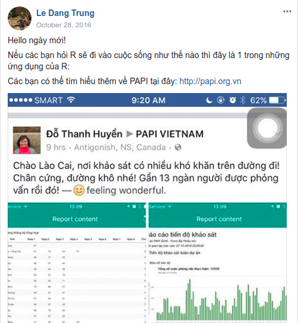
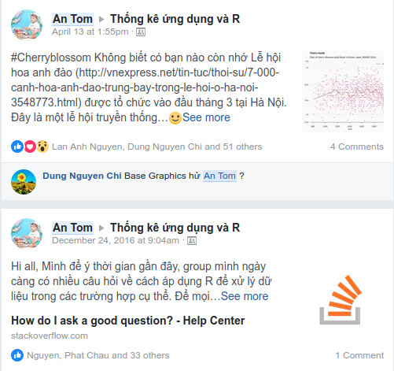
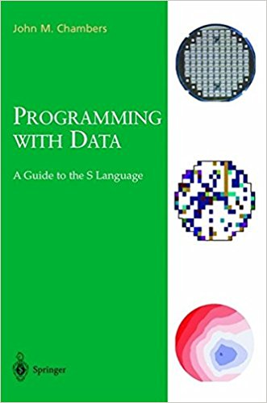
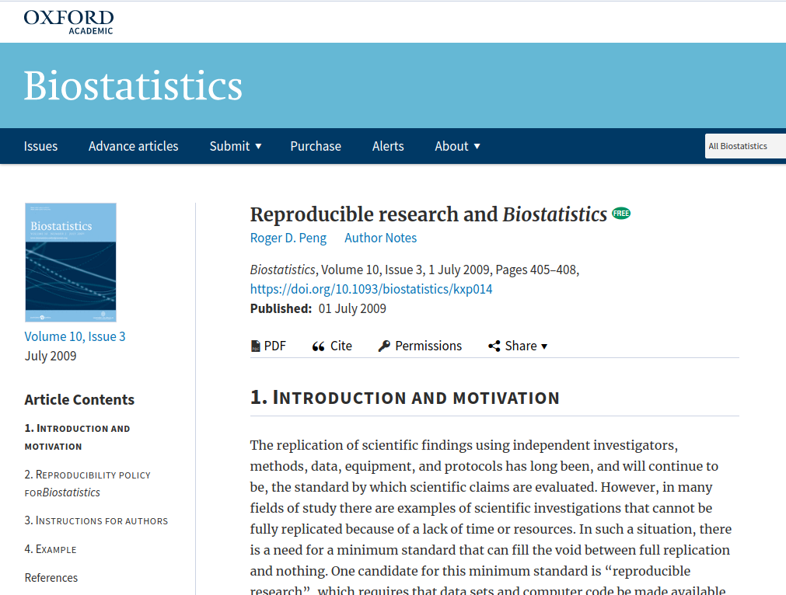
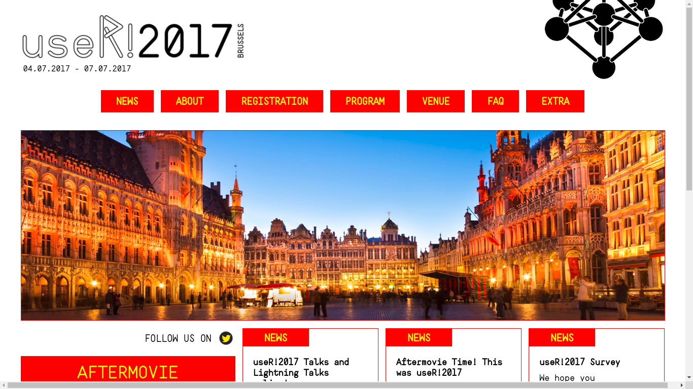
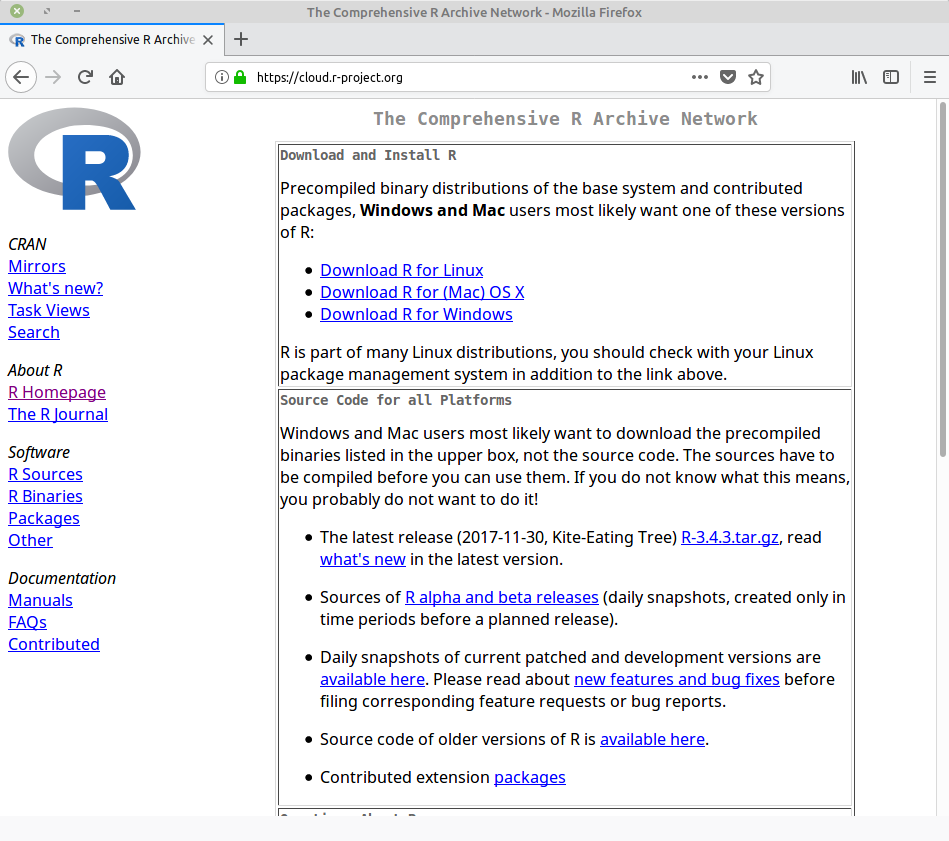
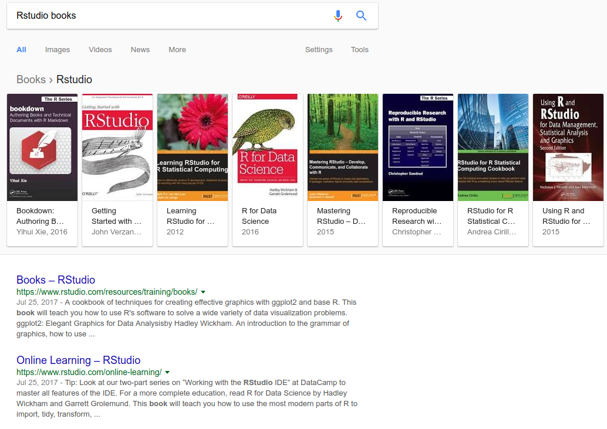
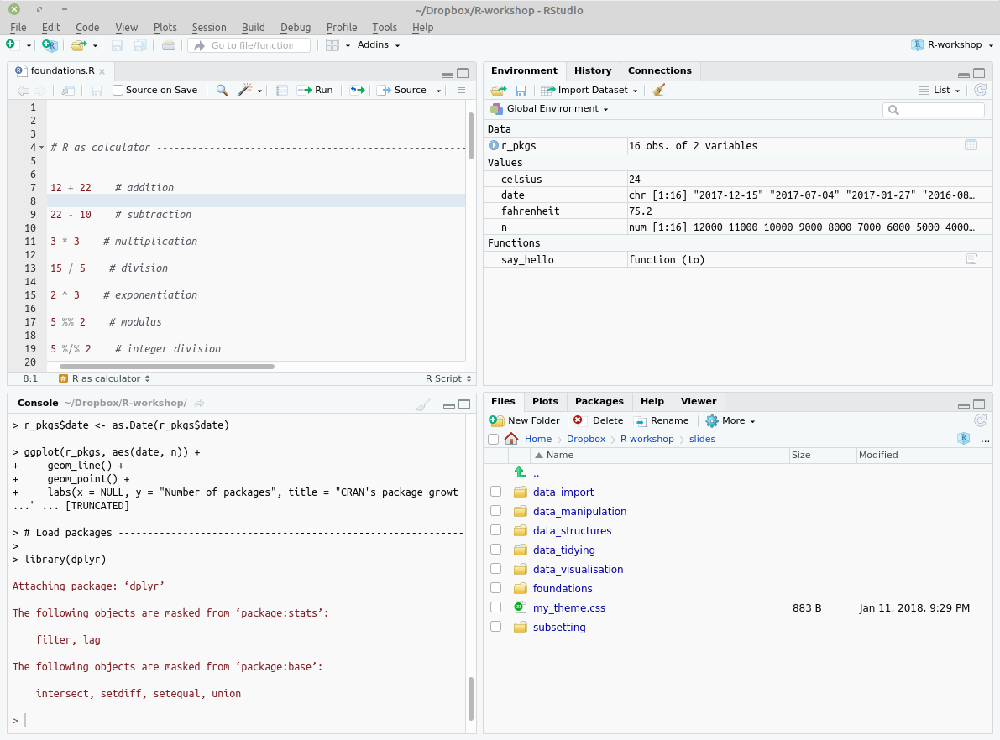
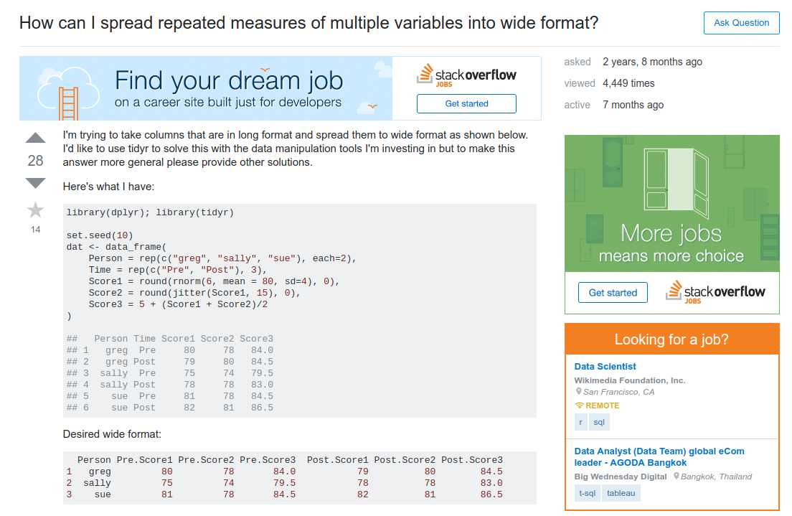

```{r setup, include=FALSE}
options(htmltools.dir.version = FALSE)
knitr::opts_chunk$set(comment = "R>", message = FALSE, warning = FALSE)
```


class: center, middle

.superbig[.bold[Hello!]]

.superenormous[.bold[Thank you for coming]]

---

# About me

--

.pull-left[
### - Data analyst ([www.rta.vn](rta.vn))

]

--

.pull-right[
### - R enthusiast

]


---

# Your turn

.huge[With your colleagues, recall the two softwares that you've recently
used for data analysis.]

<br>

.huge[You have one minute starting now!]

---

# My guess

--

.huge[1 - Excel]

--

.huge[2 - SPSS]

--

.huge[3 - SAS]

--

.huge[4 - Stata]

--

.huge[5 - R]


---
background-image: url(data_science_flow.png)
background-size: contain
class: center, middle
exclude: true


.footnote[
[R for Data Science, Hadley Wickham](http://r4ds.had.co.nz/)
]

---

# This workshop is ...

--

- .huge[not really for complete beginners]

--

<br>

- .huge[not really for experts either]

--

<br>

- .huge[not really about programming]

--

<br>

- .huge[not a comprehensive treatment of the R language]


---

# This workshop is ...

--

- .huge[a gentle introduction to .greenfont[.bold[programming with data]]]

--

<br>
- .huge[(mostly) about .greenfont[.bold[data manipulation]] and .greenfont[.bold[visualisation]]]

--

<br>
- .huge[(partly) about .greenfont[.bold[statistical analysis]]]

--

<br>
- .huge[(hopefully) .greenfont[.bold[fun]] and .greenfont[.bold[entertaining]]]


---
background-image: url(coffee.jpg)
background-size: cover

???

.footnote[
[http://fgrhs.org/2017/12/08/coffee-with-the-president-and-the-principal/]
]

---
class: inverse, center, middle

.h0[R background]


---
class: middle

.pull-left[

- .large[1976, .greenfont[.bold[S language]], John Chambers, Bell Laboratories]

<br>

- .large["to turn ideas into software, quickly and faithfully"]

]

.pull-right[

]


---
background-image: url(https://www.r-project.org/logo/Rlogo.svg)
class: bottom
exclude: TRUE

???

.footbote[
https://www.r-project.org/logo/
]

- R is a free programming language and software environment for statistical 
computing and graphics.

- Misconception: Many think of R as a statistics system. In fact, R is a true computer
language and can be considered as an environment within which statistical techniques 
are implemented.

---
background-image: url(R_paper.png)
background-size: cover

???

R is an implementation of the S programming language combined with lexical scoping
semantics inspired by Scheme. S was created by John Chambers in 1976, while at Bell
Labs.

Ross Ihaka & Robert Gentleman introduce R to the world in 1993.

---
background-image: url(RGentleman_tweet.png)
background-size: 60%
class: center, middle


---
background-image: url(R_PastFutureHistory.png)
background-size: 90%

???

https://www.stat.auckland.ac.nz/~ihaka/downloads/Interface98.pdf

R is becoming an international project.

R-Core & R Foundation formed to control design and evolution.

---
background-image: url(R_NewYorkTime.png)
background-size: 120%

???

R is growing its presence in industry.

---
background-image: url(MS_BuyRevolution.png)
background-size: 80%

???

Microsoft acquired Revolution Analytics to boost its big data business

---
background-image: url(R_Consortium.png)
background-size: cover


???

Goal: Promoting the growth and development of R as a leading platform for data 
science and statistical computing.

---

# R history in short

- .large[1991: First experimental version of R]

- .large[1993: First announcement of R to the public]

- .large[1997: R-Core Team & R Foundation formed to control the design & evolution]

- .large[2000: R 1.0.0 is released. Stable enough for production use. Packages: <70]

- .large[2015: R Consortium is launched by IMB, Google, Microsoft, Oracle, ...]

- .large[2017: R version 3.4.3 is released. Packages: >12,000 and counting]


???

Source of packages count:
https://www.r-bloggers.com/on-the-growth-of-cran-packages/
https://blog.eoda.de/2017/01/28/on-occasion-of-the-10000th-r-package-the-eoda-top-10/
http://r.789695.n4.nabble.com/Milestone-12-000-packages-on-CRAN-td4747209.html

---

# Wrap-up

--

- .large[R is an .greenfont[.bold[established programming language]] made for 
statistical data analysis and graphics.]

--

<br>

- .large[R is .greenfont[.bold[deeply rooted in academia.]]]

--

<br>

- .large[R is (arguably) the .greenfont[.bold[most popular analytics tool]] in 
the industry.]

---
class: inverse, center, middle

.h0[Why R]


---
background-image: url(R_Nature.png)
background-size: contain


---
background-image: url(nature_quotes.png)
background-size: 80%

# You want to control your own data analysis

.footnote[
[Programming tools: Adventures with R, Nature](https://www.nature.com/news/programming-tools-adventures-with-r-1.16609)
]

---
background-image: url(R_Rising.jpg)
background-size: 40%

# You want to stay current in the field

.footnote[
[Programming tools: Adventures with R, Nature](https://www.nature.com/news/programming-tools-adventures-with-r-1.16609)
]

---

# You want your research reproducible



???

https://www.ncbi.nlm.nih.gov/pubmed/26776185
https://academic.oup.com/biostatistics/article/10/3/405/293660
http://science.sciencemag.org/content/334/6060/1226/tab-figures-data

---

# You want to learn on your own way

- .large[MOOCs: coursera.org, edx.org]

<br>
- .large[Subscription-based learning platform: datacamp.com, udemy.com]

<br>
- .large[R news and tutorials: r-bloggers.com, r-weekly.org]

<br>
- .large[Books: The R Series - CRC Press, Use R! - Springer]


---

# You want to join a fantasic community




---
background-image: url(rstat.png)
background-size: contain

---
background-image: url(rstudio_community.png)
background-size: contain

---
background-image: url(r_ladies.png)
background-size: contain

---
background-image: url(TKUDR.png)
background-size: contain


---
background-image: url(pelame.gif)
background-size: contain
class: inverse, center, top

# Challenges


---
background-image: url(something-new.gif)
background-size: contain
class: inverse, center, top

# Get out of your comfort zone

???

Obstacle #1: The tool is different from what you know

Obstacle #2: The mental model underlying the tool is different from your current mental model

---
background-image: url(patience.gif)
background-size: 100% 65%
class: inverse, center, top

# Have patience

---
class: inverse, center, middle

.h0[Get started]

---

# R installation



---
background-image: url(https://www.rstudio.com/wp-content/uploads/2014/07/RStudio-Logo-Blue-Gradient.png)
background-size: 70%


# RStudio installation

### https://www.rstudio.com/products/rstudio/download/preview/

---




---

# RStudio screen




---
background-image: url(R_console.png)
background-size: 70% 60%

.large[The **Console** pane is where R executes codes and returns output.]

---
background-image: url(R_environment.png)
background-size: 70% 60%

.large[The **Environment** pane shows anything you create (data, values, functions, ...) 
during the R session.]


---
background-image: url(R_history.png)
background-size: 70% 60%

.large[The **History** pane keeps a record of all previous commands.]

---
background-image: url(R_file.png)
background-size: 70% 50%

.large[The **File** pane show all files and folders in your default workspace]


---
background-image: url(R_plot.png)
background-size: 70% 60%

.large[The **Plot** pane show all your graphs]


---
background-image: url(R_help.png)
background-size: 70% 60%

.large[The **Help** pane is where you can find R documentation]

---
background-image: url(R_source.png)
background-size: 70% 50%

.large[The **Source** pane (R script) is where you keep a record of your work (same as
do-file in Stata)]


---

# Explaining output on slides

.large[In slides, a command (we’ll also call them code or a code chunk) will look
like this:]

```{r}
print("I am coding in RStudio")
```

.large[And then directly after it, will be the output of the code.]


---

# Working directory

.large[R associates itself with a folder (i.e. directory) on your computer.]

- .large[This folder is known as your "working directory"]

- .large[When you save files, R will save them here]

- .large[When you load files, R will look for them here]


---

# Working directory

.large[The files pane of the IDE displays the contents of your working directory]


```{r}
# print working directory
getwd()
```


```{r, eval=FALSE}
# change working directory
setwd("~/Documents/data_projects/") 
```


---
background-image: url(directory-structure.png)
background-size: 75%
class: right, middle

# Workflow: Project-oriented


???

- What is real

- Working directory

- Path and directory

- RStudio Project

- Summary

http://r4ds.had.co.nz/workflow-projects.html#what-is-real


---
background-image: url(Rstudio_project.png)
background-size: 65%


# RStudio Project


---
class: inverse, center, middle

.h0[R basics]


---

# R as calculator


```{r, eval=FALSE}
12 + 22    # addition

22 - 10    # subtraction

3 * 3    # multiplication

15 / 5    # division

2^3    # exponentiation

5 %% 2    # modulus

5 %/% 2    # integer division
```

---

# Operator precedence

.scp[
.large[`^`: exponentiation]
    
.large[`-`: unary minus]
    
.large[`:` sequence operator (colon)]
    
.large[`%/%` and `%%`: integer division, remainder]
    
.large[`*` and `/`: multiplication, division]
    
.large[`+` and `-`: addition, subtraction]
]

---

# Guess the result

.pull-left[
```{r, eval=FALSE}

2^3^2

(2^3)^2

2^(3^2)
```
]

--

.pull-right[
```{r}

2 ^ 3 ^ 2

(2 ^ 3) ^ 2

2 ^ (3 ^ 2)
```

]

---
background-image: url(style_matters.png)
background-size: 60%
class: center, middle


---

# Spacing

- .large[Place spaces around most infix operators (`+`, `-`, `*`, `/`, `%%`)]

- .large[except `:` and `^`]


.pull-left[

```{r, eval=FALSE}
# Bad

1+(2/3)*5*4

sqrt(x ^ 2 + y ^ 2)

x <- 1 : 10
```

]

.pull-right[

```{r, eval=FALSE}
# Good

1 + (2 / 3) * 5 * 4

sqrt(x^2 + y^2)

x <- 1:10
```

]


---

# Comments


```{r}
# print("this is the first comment line")
print("this is the second comment line")
```


---

# Comments

- .large[Use comments to document your code. Comments should explain the .greenfont[.bold[why]], 
not the .greenfont[.bold[what]]]
    
```r
# Good: '# use cat() to keep track of looping index'

# Bad: '# print out index'
```
    
- .large[Use commented line of - to organise block of codes]
    
```r
# import data -------------------------------

# plot data ---------------------------------
```

---

# Variable assignment

.large[Just like in algebra, `variable` is used to store a computation so that it can
be reused]

--

- .large[Assignment statements:]

```{r}
celsius <- 24
fahrenheit <- (celsius * 9 / 5) + 32
print(fahrenheit)
```

--

- .large[`<-` is called assignment operator (Tip: press 'Alt+-' in RStudio)]

--

- .large[Style guide: `Use <-, not =, for assignment.`]

???

http://blog.revolutionanalytics.com/2008/12/use-equals-or-arrow-for-assignment.html


---

# Functions

- .large[Everything in R is done through functions.]

--

.large[Built-in functions:<sub>1</sub>]

```{r, eval=FALSE}
abs(-145)    # absolute value

sqrt(9)    # square root

sum(c(1, 3, 5, 7, 9))    # sum of all values

lm(dist ~ speed, data = cars)    # fit linear models

plot(cars$speed, cars$dist)    # generate X-Y plot
```

.footnote[
[1][Commonly used built-in functions](https://www.statmethods.net/management/functions.html)
]


---

# Functions

- .large[Everything in R is done through functions.]

.large[User-written functions:<sub>1</sub>]

```{r}
say_hello <- function(to) {
    paste0("Hello ", to, ". Nice to meet you!")
}

say_hello(to = "An Chu")
```


.footnote[
[1][Functions in R](https://www.datacamp.com/community/tutorials/functions-in-r-a-tutorial)
]

---

# Your turn

.large[Write your own function to convert Fahrenheit to Celsius degree.]

```{r, eval=FALSE}
to_celcius <- function(x) {
    # your code goes here
    
}
```

```{r, echo=FALSE}
to_celcius <- function(x) {
    fah <- (x - 32) * 5 / 9
    paste0(x, " Fahrenheit is equal to ", fah, " Celcius")
}
```

.large[Expected output:]

```{r}
to_celcius(x = 50)
```

---

# Solution


```{r}
to_celcius <- function(x) {
    fah <- (x - 32) * 5 / 9
    paste0(x, " Fahrenheit is equal to ", fah, " Celcius")
}
```


---

# Naming convention

--

- .large[Variable and function names should be lowercase]

--

- .large[Use an underscore (_) to separate words within a name]

--

- .large[Generally, variable names should be nouns and function names should be verbs]

```r
# Good
customer_churn
measure_churn_rate()

# Bad
CusChurn
churnRate()
```

---

# Wrap-up

--

- .large[R uses objects (variables) to store values and call functions to compute on objects]

--

- .large[Style matters]


---

# The design of R system

.large[The R system is divided into 2 parts:]

<br>

- .large[The "base" R system that you download from https://www.r-project.org/]

<br>

- .large[Everything else]

---

# R packages

.large[R functionality is deployed through *packages*]

--

- .large[The "base" R system = default packages (mostly developed by the R-Code Team)]

--

- .large[Other packages: CRAN, Bioconductor, Github (contributed by users, programmers)]

---
background-image: url(rpackages_growth.svg)
background-size: 90%
class: center, middle


---
background-image: url(CRAN_TaskViews.png)
background-size: cover

---
background-image: url(Bioconductor.png)
background-size: cover


---

# Working with R packages

--

- .large[R package is, essentially, a collection of functions and data sets that aims
to solve a specific problem]

--

- .large[Install a package:]

```{r, eval=FALSE}
# syntax:
# install.packages(pkgs = "name_of_package(s)")

install.packages("dplyr")

install.packages(c("tidyr", "ggplot2"))
```


- .large[Check what packages are installed:]

```{r, eval=FALSE}
installed.packages()
```


???

[DataCamp - A beginner's guide to R packages](https://www.datacamp.com/community/tutorials/r-packages-guide)


---

# Working with R packages


- .large[Remove packages:]

```{r, eval=FALSE}
remove.packages(pkgs = "ggvis")
```

- .large[Update all packages:]

```{r, eval=FALSE}
update.packages()
```

- .large[Load package into R workspace]

```{r, eval=FALSE}
library("dplyr")
```


---

# Your turn

.large[Make sure you have the following packages installed on your laptop]
    
<br>

.large[`readr`, `tidyr`, `dplyr`, `stringr`, `ggplot2`]


---
background-image: url(https://media1.tenor.com/images/0289ce650765491b752d3f9f23015688/tenor.gif?itemid=5012692)
background-size: contain
class: inverse, center, bottom

# Dealing with errors


---
background-image: url(helpme_helpyou.gif)
background-size: contain
class: inverse, center, top

# Help yourself first

---

# How 1

--

- .huge[Checking for typos]

--

<br>

- .huge[Reading the manual (documentaion, vignettes)]

--

<br>

- .huge[Inspection and experimentation (trials and errors)]

---

# How 2

.large[Usually, there might be someone else already asked the same questions. Try to
find an answer by:]

--

- .large[Searching the Web (Google will lead you to StackOverflow, R-bloggers)]
  
--

<br>

- .large[Asking a skilled friend]

---

# How 3

- .large[There are three things you need to include to make your questions/bugs 
reproducible: required packages, data, and code]




---

# Summary

.large[R has a fantastic ecosystem, including:]

- .large[An IDE (RStudio) tailored to data analysis and statistical programming]
    
- .large[A vibrant and helpful community]
    
- .large[A dedicated group of contributors (R Foundation + R-Core Team + ...)]
    
- .large[A very rich and diverse learning resources for users]
    
- .large[A strong userbase in both academia and industry]
    

???

.footnote[
[1] [The R Ecosystem](http://blog.revolutionanalytics.com/2011/08/the-r-ecosystem.html)
[2] [More components of the R ecosystem](http://f.briatte.org/r/more-components-of-the-r-ecosystem)
]


---

# Acknowledgement

.large[Above materials are derived in part from the following sources:]

- .large[Advanced R by Hadley Wickham (http://adv-r.had.co.nz/)]

- .large[R Programming Course by Roger D.Peng (https://www.coursera.org/learn/r-programming)]

- .large[Blogs/articles on the Internet]

- .large[Images are downloaded from the Internet]

---
class: inverse, center, middle


.h0[Q&A]
