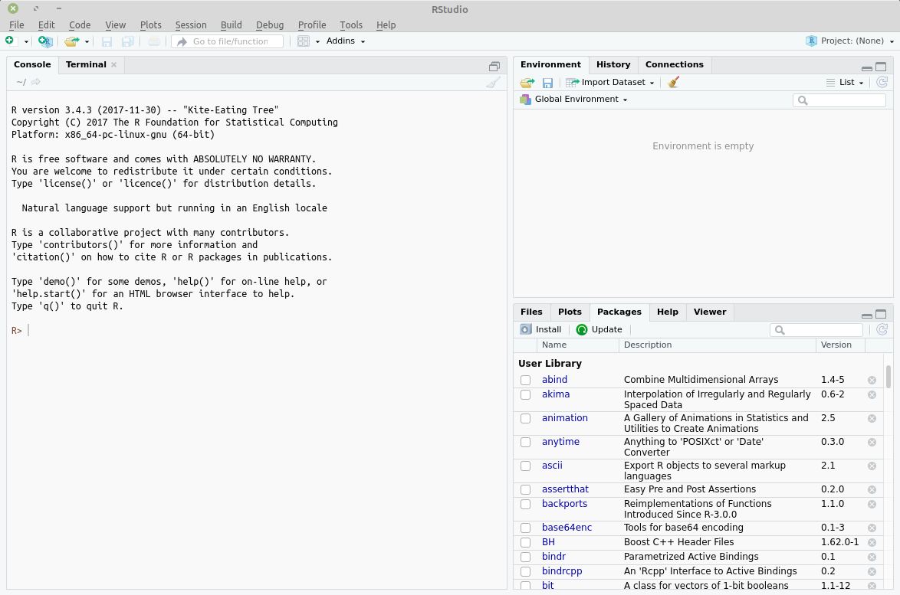

--------------------------------------------------------------------------------

### Step 1: Install R

- Download the R installer from: https://cloud.r-project.org/. The latest version
of R is 3.4.3

- I recommend you install a precompiled binary distribution for your operating system.

 

 

- For Mac and Windows users, just run the installer: `R-3.4.3.pkg` and `R-3.4.3-win.exe`.
Default settings are fine.

- For Linux users, you might want to consult this tutorial (https://www.digitalocean.com/community/tutorials/how-to-install-r-on-ubuntu-16-04-2).
In case you are using other Linux distros, there’s official installation guide on the R Project website.

 

### Step 2: Install RStudio

- RStudio is a powerful IDE (stands for *integrated development environment*) for R.
Just like Microsoft Word that helps you write and format texts, RStudio makes it 
much easier to write and run R codes.

- I recommend you install the Preview version of RStudio which can be downloaded from:
https://www.rstudio.com/products/rstudio/download/preview/

 

 

- If you already installed R and/or RStudio, I highly recommend that you reinstall
both and get as current as possible.

 

### Step 3: Check that R and RStudio are working

- Open RStudio. It should open a window that looks similar to image below. (I am 
using a Linux machine)

- If this is not successful, contact us for further support.

 

